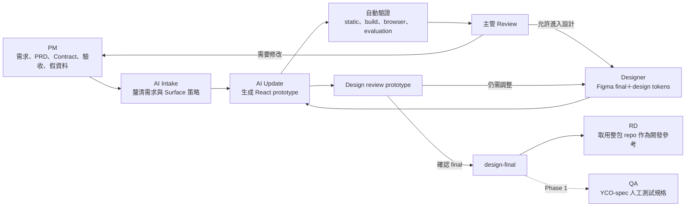

# YCO Collab Space 跨部門使用指南

這個空間讓 PM、主管、Designer、RD 與 QA 使用同一份可追溯的產品資料，
但不要求每個角色都直接修改 prototype code。

> 目前狀態：已可完成「PM Intake → AI 生成 React prototype → 自動驗證 → 人工 review →
> Designer refinement → evidence-bound design-final」。YCO-spec adapter與Figma API自動匯入仍在後續階段。

Designer 與 RD 在建立正式 `/platform` 前，請共同 review
[`Phase 1 Design System Foundation 指南`](docs/design-system/phase1-designer-rd-foundation-guide.md)。

## 一張圖看懂流程



主管的 feedback 不需要另外建立一份逐字紀錄；PM 將 feedback 轉成明確需求，更新
source-of-truth 後，再重新生成 prototype。

## 每個角色負責什麼

| 角色 | 負責的內容 | 如何看成果 | 原則上不做什麼 |
|---|---|---|---|
| PM（目前也是 Collab Space Owner） | Intake、PRD、行為 Contract、驗收條件、假資料、Surface 策略與最終範圍決策 | 執行本機 preview 或之後的公開 preview URL | 不手改 `generated/**` |
| 主管 | 操作 prototype、判斷是否允許開發、把修改方向告訴 PM | 只需開啟 preview URL | 不必操作 repo，也不必另寫 feedback log |
| Designer | 提供 Figma final、design tokens與全域 Design Library素材；可觸發 update 即時查看結果 | 本機或公開 preview URL／本機 Library Browser | 不需寫 manifest；目前建議不手改 prototype code，也不改 PM 的產品行為 |
| AI Agent | 訪談 Intake、依來源檔生成 React／SCSS、執行驗證並留下 provenance | 回報 gate 與 evidence | Update 時不得改 PM／Designer source-of-truth |
| RD | 在 design-final 後取得整個 private repo，參考 UI code、tokens 與行為規格，再搬到 RD repo 串後端 | clone／下載 repo | 不需把 RD repo 合回這個空間；這裡的 prototype 永遠不串後端 |
| QA | 使用保留的 YCO-spec 做人工測試 | 規格頁與 prototype | 新 repo 的 YCO-spec adapter 尚未實作，Phase 1 前仍沿用既有流程 |

## 哪些檔案才是 Source of Truth

每個功能位於 `features/<feature-slug>/`。

| 位置 | 內容 | 主要 Owner | 性質 |
|---|---|---|---|
| `product/intake.md` | 需求訪談結論與尚未回答的問題 | PM | Source of truth |
| `product/prd.md` | 產品目的、範圍與需求 | PM | Source of truth |
| `product/prototype.contract.yaml` | Prototype 必須具備的狀態、事件與結果 | PM | 可執行的 source of truth |
| `product/validation.yaml` | 驗收條件 | PM | Source of truth |
| `product/surface-intent.yaml` | `reuse`／`hybrid`／`novel` 的 Surface 決策 | PM | Source of truth |
| `product/mocks/**` | 假資料；不得包含正式資料或後端連線 | PM | Source of truth |
| `product/decisions.md` | 會影響產品或架構的決策與判斷依據 | PM | Source of truth |
| `product/media-intent.yaml` | 本功能要查詢的全域素材 collection與用途 | PM | Source of truth |
| `product/mock-assets/**` | PM第一版暫時素材；design-final禁止 | PM | Temporary source |
| `design/design.ref.json`、`design/design-gaps.yaml` | 設計參考與尚缺的 token／component | Designer；初期可由 PM 標示缺口 | Source of truth |
| `generated/**` | AI 依上述來源產生的 React／SCSS | AI | 衍生物，可重建；禁止手改 |
| `evidence/**` | Browser check、截圖與驗證結果 | 工具／AI | 衍生物，可重建 |
| `releases.json` | 綁定輸入、token、素材 hash與角色核准的階段紀錄 | 流程工具 | Record；不要手改 |

共用平台資料不屬於單一功能：

| 位置 | 用途 | 變更權限 |
|---|---|---|
| `design-library/assets/<type>/<collection>/**` | 全域共用或目前feature-specific的 Designer素材 | Designer上傳；不需 manifest |
| `design-library/tokens/**`、`components/**`、`patterns/**` | 未來 Figma export與Designer/RD共同契約 | Designer／RD共同決定；目前可逐步補 |
| `platform/tokens/rd/**` | RD 提供的 design token snapshot，現階段的 token 基準 | 視為唯讀；缺漏由 Designer／RD 討論後補充 |
| `platform/surfaces/**` | 可重用的 Surface Pack | Collab Space Owner 管理 |
| `platform/ui/**`、`platform/runtime/**` | 共用 UI 與 prototype runtime | 平台層變更，需比單一 feature 更嚴格 review |
| `tools/**`、`evals/**` | 生成、驗證與 evaluation 系統 | Collab Space Owner／工具開發者 |

`.collab-cache/**` 是工具自動建立的本機 index，不需人工維護、不 commit、也不會進公開 preview。

## 新功能怎麼開始

### 1. PM 建立功能骨架

```bash
npm run prototype:create -- <feature-slug> "<Feature Name>"
```

例如：

```bash
npm run prototype:create -- image-relight "Image Relight"
```

### 2. 先做 Intake，不先硬選 Surface Pack

- Claude：執行 `/prototype-intake <feature-slug>`
- Codex：要求它使用 `prototype-intake` skill 訪談該功能

Intake 會先釐清問題、review 目標、必要狀態、假資料與驗收條件，再由 PM 確認
摘要。確認前不應寫入正式 product source。

### 3. 選擇 Surface 策略

| 策略 | 何時使用 | 做法 |
|---|---|---|
| `reuse` | 新功能明確符合一種既有頁型 | 使用一個 Surface Pack 的 component 與 layout 骨架 |
| `hybrid` | 大致符合既有頁型，但有重要的新區塊 | 沿用主要骨架，明確記錄需要改造的部分 |
| `novel` | 全新功能，沒有合適樣板 | 不阻擋 Intake；先依需求建立 provisional structure，再把可重用模式回饋到 catalog |

Surface Pack 是加速器，不是新功能的准入條件。Catalog 草案見
[`docs/surfaces/surface-pack-catalog-draft.md`](docs/surfaces/surface-pack-catalog-draft.md)。

### 4. 生成或更新 prototype

- Claude：執行 `/prototype-update <feature-slug>`
- Codex：要求它使用 `prototype-update` skill 更新該功能

Update 只應改 `generated/**` 和可重建的 evidence；若偵測到 `product/**` 或
`design/**` 被生成步驟改動，流程必須失敗。

素材不需逐檔登記。PM在功能需求中指定例如 `assets/video/dance`，Agent只 index該
collection，再把本版實際使用的檔案與 hash鎖進 `generation.json`。Designer沒特別說明時，
新上傳檔案預設都是 candidate；到 design-final前才一次確認本版 selection。

Designer／PM可用 `npm run library:browser` 在本機看所有 collection。這個 browser不屬於
公開 Vite app，public build只會包含prototype實際引用的素材。

### 5. 驗證與 review

```bash
npm run validate
npm run build
npm run test:rendered -- --feature <feature-slug>
```

功能狀態的意思：

| 狀態 | 意思 | 可否交給下一角色 |
|---|---|---|
| `INVALID` | Contract、build 或 rendered behavior 有失敗 | 不可 |
| `FUNCTIONALLY_READY` | 功能與自動 gate 通過，但尚未完成視覺人工審核 | 可給 PM／主管操作，不能宣稱 design final |
| `PM_REVIEW_READY` | PM 已確認功能與 review 目標 | 可送主管／Designer |
| `DESIGN_FINAL_READY` | Designer final、必要視覺 review 與交付條件已完成 | 可交 RD；完整自動 promote 屬 Phase 1 |

請直接用自然語言請 Agent移到下一階段。Agent會列出 evidence並等待必要角色同意；底層
`stage:transition` 會把核准綁定當下 input／generation hash。內容變更後舊核准不會沿用。
`rd-handoff` 與 `qa-spec` 都從同一個 design-final平行產生。

## 常見修改情境

| 情境 | 誰先改什麼 | 接著做什麼 |
|---|---|---|
| 主管要求改流程或功能 | PM 更新 PRD／Contract／validation／mock | 重新執行 prototype update 與驗證 |
| 主管只要求改視覺方向 | PM 先把要求轉成可交付的設計需求；Designer 之後納入 Figma／token | 重新 update，產生 design review prototype |
| Designer 發現缺 token | 記錄在 `design/design-gaps.yaml`，與 RD 討論是否補進權威 token | 未確認前不在 feature 內自創 token 值 |
| Designer 想即時看成果 | Designer 可以觸發 update | 建議仍由來源檔驅動，不直接手改 `generated/**` |
| RD 要開始正式開發 | PM 告知哪個 feature 已達 design-final | RD 取得整個 repo，自行搬到 RD repo 串後端 |
| 新功能沒有可用 Surface | PM 選 `novel`，記錄理由 | 先做 provisional structure，不因 catalog 缺少頁型而卡住 |

## 所有人都要遵守的界線

- Prototype 一律使用假資料，不串後端，不放正式個資、token 或 secret。
- `generated/**` 是可重建成果，不是 source of truth；任何修改都應先回到 PM 或
  Designer 的來源檔。
- RD tokens 是現階段基準；現有舊專案內的 local tokens 不作為新 repo 的依據。
- Designer 的實際協作方式目前只保留建議，待 Designer 看過並同意後才強制。
- GitHub repo 預計為 private；preview 是否公開、如何控管權限留待後續討論。
- 公開 preview 即使網址不易猜，也不等於有權限保護；只可放 mock-only prototype。
- 不直接覆寫已確認的 final；新的修改應保留 Git history 與可追溯的決策。

## 目前已完成與尚未完成

| 能力 | 狀態 |
|---|---|
| PM Intake 與確認 gate | 已完成 |
| React／SCSS prototype 生成骨架 | 已完成 |
| `reuse`／`hybrid`／`novel` Surface 策略 | 已完成 |
| Source mutation protection | 已完成 |
| Build、rendered、mutation、workflow evaluation | 已完成 |
| 視覺品質自動判定 | 尚未校準，仍需人工 review |
| Designer／Figma final ingestion | Phase 1；流程規則待 Designer 確認 |
| YCO-spec 自動產生 | Phase 1；既有 QA 人工 spec 必須保留 |
| Evidence-bound stage transition／design-final gate | 已完成；Git tag仍可後續加入 |
| Shared Design Library collection index／local browser | 已完成 |
| GitHub | 已設定 private `origin` |
| Vercel 綁定 | 尚未執行，由 repo owner 後續處理 |
| Preview 存取權限 | 後續團隊討論，本版不強制 |

## Repo 身分與 GitHub 串接

本機資料夾、package、畫面、文件、agent adapters、內建 readiness fixture 與
evaluation case 已統一使用 `yco-collab-space`／`YCO Collab Space`。

| 項目 | 目前狀態 | 接下來怎麼做 |
|---|---|---|
| 本機路徑 | `/Users/jasonchen/Documents/Claude/Projects/yco-collab-space` | Codex、Terminal 或 Editor 若仍指向舊路徑，重新開啟本資料夾 |
| Git history | 隨整個 `.git` 目錄保留 | 建立 GitHub private repo 後再設定 remote |
| GitHub | 已設定 private `origin` | 團隊以 `yco-collab-space` repo 協作 |
| Vercel | 尚未 link | GitHub 完成後，再由 repo owner 以新名稱建立／link project |
| Evaluation evidence | 改名後應重新生成 | 以新 slug 執行 workflow、mutation 與 visual packet evaluation |
| Dependencies | package identity 已改名 | 執行 `npm install` 與完整 gates，確認 lockfile 和 build |

這次改名保留「prototype factory」作為架構模式的描述；它不再是 repo 或產品名稱。

## 決策判斷依據

- PM 與 Designer 各自維護來源，AI 只重建 prototype，可避免「直接改 code 後，需求或
  設計決策消失」的問題。
- PM 先做 Intake 再選 Surface，才能支援真正的新功能；Surface Pack 只能提供起點，
  不能成為 allowlist。
- Designer 可觸發 update，因為安全邊界是「什麼檔案可被改」，不是「誰按下指令」。
- RD 取得整包 repo 能同時看到需求、token、generated code 與驗證依據；正式 production
  code 與後端整合仍由 RD repo 負責，避免兩個 repo 互相覆寫。
- mock-only 是允許公開 preview 的最低安全前提，但「不知道 URL」不是存取控制，因此
  preview 權限仍應保留為後續治理議題。
- 改名時尚未綁 GitHub／Vercel，因此不需處理 remote redirect、deployment link 或既有
  團隊 checkout；在正式串接前完成 repo 身分統一，風險低於上線後再改。
