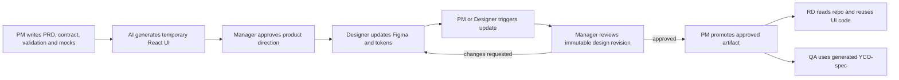

# YCO Collab Space — target architecture

> **Status:** architecture direction confirmed with the project PM on 2026-08-30.
> Phase 0 local implementation started the same day. This repository implements the
> target architecture without changing the live legacy pipeline.
>
> **Companion plan:** [2026-08-30-phase0-implementation-plan.md](./2026-08-30-phase0-implementation-plan.md)
>
> **Legacy references:** [ARCHITECTURE-ELI5.md](./ARCHITECTURE-ELI5.md) ·
> [WORKFLOW.md](./WORKFLOW.md) ·
> [2026-08-26-multiplayer-readiness.md](./2026-08-26-multiplayer-readiness.md)

---

## 1. The answer in one minute

The new repository should be a **prototype factory**, not a smaller copy of RD's
production application.

Think of it like a kitchen:

- PM writes the order: what screens, states, actions and validation must exist.
- Designer later supplies the final plating guide: Figma and design tokens.
- AI is the cook: it turns those approved inputs into React and SCSS.
- The generated prototype is the plated dish. PM and Designer do not edit it by hand.
- Git records the exact dish that was reviewed, even though the recipe remains the
  source of truth.
- RD can inspect the whole kitchen, then reuse the UI components and styles while
  connecting the real application, data and backend in the RD repository.

This is feasible, with one important qualification: an AI-generated novel UI is not a
fully deterministic compiler output. Generated code must therefore be committed,
reviewed and tied to exact input hashes. A normal build must never silently ask AI to
regenerate it.

---

## 2. The confirmed product workflow

Only PM and Designer actively create prototype inputs. The manager reviews outputs;
RD and QA consume the final handoff.



The lifecycle names are:

```text
pm-draft
  → pm-approved
  → design-working
  → design-review-01 / design-review-02 / ...
  → design-final
  → RD and QA handoff
```

Rules:

1. `pm-draft` may use a temporary UI and unresolved design gaps.
2. Every version sent to the manager is immutable.
3. `design-working` may continue changing between review submissions.
4. The approved review artifact is promoted to `design-final` without rebuilding it.
5. PM owns product behaviour; Figma and tokens own presentation.
6. If final design changes product flow, state, validation or scope, PM must first
   update the product contract.

---

## 3. Why the RD repository is a reference, not the new runtime

The inspected snapshot is:

```text
/Users/jasonchen/Downloads/yce-frontend-gm-260909
```

Evidence from that snapshot:

- `package.json` identifies a Next.js 13.0.5, React 18.2.0, JavaScript and Yarn 1
  application.
- Pages are thin wrappers around production infrastructure. For example,
  `src/pages/photo-enhance/index.js` combines CMS static props, SEO, a shared layout
  and a feature component.
- `src/pages/_app.js` boots Redux persistence, auth-related state, monitoring,
  localisation, analytics, global overlays and other production-only services.
- The build pipeline fetches CMS content, performs a Next static export and includes
  environment-specific Gulp deployment tasks.
- Most component styling uses SCSS Modules.
- `src/styles/variables.css` and `variables-custom.css` are the token inputs used by
  the application. The inspection found roughly 249 unique custom-property names,
  including responsive overrides.

These facts support two separate decisions:

| Decision | Reason |
|---|---|
| Match React component and SCSS Module conventions | This makes feature UI and styles easier for RD to understand and reuse. |
| Do not clone the full Next.js application | CMS, auth, Redux, production routing, analytics and deployment complexity do not help a static mock-data prototype. |

The new stack is therefore:

- Vite
- React
- JavaScript
- SCSS Modules
- RD token names and values
- Playwright for rendered validation

JavaScript is deliberate: the supplied RD code is JavaScript, so this minimises
translation when RD references or copies UI code. Vite is deliberate: the prototype
does not need Next.js server rendering, CMS fetching or production application boot
logic.

---

## 4. The source-of-truth model

There is not one giant source-of-truth file. There are three authorities with
non-overlapping responsibilities.

| Authority | Owns | Does not own |
|---|---|---|
| PM product source | PRD, approved prototype contract, validation, UX data needs and mock scenarios | Final visual styling, production API schema |
| Design source | Final Figma design and design tokens | Product flow, business rules, generated React code |
| Platform source | Generator, shared prototype runtime, validation tools and token baseline integration | Feature requirements |

Generated React and SCSS are a **versioned derived artifact**:

- They are committed to Git so RD receives stable code and reviewers see stable output.
- PM and Designer do not manually edit them.
- Generation records input hashes, generator version and the resulting diff.
- A deterministic build compiles committed code; it does not call AI.
- AI generation runs only during an explicit update workflow.

This avoids two bad outcomes:

1. Treating generated code as the only truth, which loses PM and design intent.
2. Regenerating from scratch on every build, which can produce a different result from
   identical prose.

### PM's executable contract

PM continues to own human-readable documents, but AI also produces a reviewed
`prototype.contract.yaml`. It captures:

- screens and entry points;
- user actions and state transitions;
- loading, success, empty, error and edge states;
- validation and acceptance criteria;
- mock-data requirements;
- design references when available.

PM approves this contract. If PM documents change while the contract is stale, update
and promotion must stop. A build cannot repeatedly reinterpret arbitrary Markdown.

### Mock data is not an API contract

All prototypes use synthetic data and do not call a backend.

The PM contract describes the data the UI needs and the user-visible result. It does
not invent final endpoints, payloads, error codes or backend models. If an approved API
contract already exists, the prototype may reference it; otherwise RD owns the final
integration.

---

## 5. Target repository shape

The agreed repository is:

```text
Git repository: yco-collab-space
Local path:     /Users/jasonchen/Documents/Claude/Projects/yco-collab-space
GitHub:         private
```

It must be a standalone sibling repository, not nested inside the legacy repository.

Recommended structure:

```text
yco-collab-space/
├── AGENTS.md
├── README.md
├── package.json
├── prototype.config.json
├── app/                         # Vite review shell and feature registry
├── features/
│   └── <feature>/
│       ├── product/             # PM-owned inputs
│       │   ├── prd.md
│       │   ├── prototype.contract.yaml
│       │   ├── validation.yaml
│       │   └── mocks/
│       ├── design/              # design references and gaps
│       │   ├── design.ref.json
│       │   └── design-gaps.yaml
│       ├── generated/           # committed AI output; no manual edits
│       │   ├── components/
│       │   ├── styles/
│       │   └── feature.js
│       ├── evidence/            # screenshots and validation reports
│       ├── handoff/             # later: RD and QA manifests
│       └── releases.json
├── platform/
│   ├── runtime/                 # mock routing, state and review utilities
│   ├── ui/                      # small reusable presentational component set
│   └── tokens/
│       ├── rd/<version>/        # immutable upstream CSS snapshot
│       ├── extensions/          # later, after Designer agreement
│       └── tokens.lock.json
├── tools/
│   ├── prototype-cli/
│   ├── validation/
│   └── yco-spec/                # Phase 1 adapter and preserved engine
└── agent-adapters/
    ├── claude/
    └── codex/
```

The structure is feature-first because RD, PM, Designer and QA should find one complete
feature package in one place. Role ownership is represented by subfolders instead of
separate global PM and Designer trees.

---

## 6. Token architecture

The local legacy design-token set is not authoritative for the new repository. The RD
snapshot is the baseline.

Phase 0 rules:

1. Copy only the reviewed RD token CSS files, not the RD repository.
2. Preserve the baseline byte-for-byte in a versioned, read-only folder.
3. Record file hashes and token names in `tokens.lock.json`.
4. Feature code may use token references but may not invent raw visual values.
5. AI may choose the closest existing token for a temporary PM UI, but must record the
   choice in `design-gaps.yaml`.
6. Missing tokens must ultimately come from Designer.
7. Existing RD names or values are locked. A change is allowed only after Designer and
   RD agree on a versioned resolution.

Why not convert everything to JSON immediately:

- The RD CSS includes aliases and responsive overrides.
- A format conversion can silently change ordering, fallback or media-query behaviour.
- Phase 0 needs a faithful baseline more than a theoretically ideal token pipeline.

A DTCG-compatible JSON source can be evaluated later, after Designer and RD agree on
the format and a parity test proves that generated CSS is equivalent.

---

## 7. Component strategy

Do not import or migrate the full RD component tree.

The production snapshot contains components coupled to Next routing, localisation,
Redux, CMS, authentication and product services. Copying it wholesale would recreate
the production application's weight without its backend.

Instead:

- Start with a small `platform/ui` set of presentational primitives needed by the
  first pilot.
- Follow RD naming, prop shape and SCSS Module conventions where they are genuinely
  reusable.
- Keep feature-specific components inside the feature.
- Promote a component to shared only after its API is stable and the Prototype
  Platform Owner approves the change.
- Never make the RD snapshot a package or runtime dependency.

The project PM is also the initial Prototype Platform Owner. Feature generation cannot
silently modify shared runtime or components.

---

## 8. Update, build and promote are different operations

The user-facing agent workflows are:

```text
/prototype-update <feature>
/prototype-promote <feature> <stage>
```

`/prototype-update` may be triggered by PM or Designer. It:

1. reads approved inputs;
2. checks hashes and design gaps;
3. asks AI to create or patch generated code;
4. runs deterministic build and rendered validation;
5. creates an isolated working or review preview;
6. records generation metadata and the code diff.

`/prototype-promote` is restricted conceptually to PM. It points a milestone at the
already-tested artifact; it does not rebuild.

The core is agent-neutral:

- schemas, CLI, build and validation do not depend on a particular AI vendor;
- thin Claude and Codex adapters provide the agent workflow;
- the main model is selected by the execution environment, not hard-coded;
- subagent roles may have preferred models and fallbacks in repo-level policy;
- initial policy is Claude-first with Codex compatibility;
- `design-final` requires review by an agent that did not build the artifact, with
  cross-model review preferred when available.

Phase 0 PM drafts use fast mechanical validation. The independent agent gate becomes
mandatory at `design-final`.

---

## 9. Version and review model

The new repository does not copy `v1`, `v2` and `v3` folders.

Each submitted review version is represented by:

- a Git commit;
- an immutable Git tag;
- a commit-specific preview URL;
- a row in `releases.json` with stage, input hashes and generator version.

The feature folder contains only the current working source. Git restores historical
versions when required.

Manager feedback is not stored as a separate review log. PM translates accepted
feedback into product-source changes. The diff is the history. Promotion records the
artifact and promoter, not the manager's conversation.

---

## 10. Validation and preview policy

Working preview and release gates have different purposes.

| Stage | May show validation errors? | Purpose |
|---|---:|---|
| `pm-draft` / `design-working` | Yes | Fast iteration; clearly marked not review-ready |
| `pm-approved` / `design-review-*` | No blocking errors | Manager review |
| `design-final` | No; independent review required | RD and QA handoff |

At minimum, a review-ready build checks:

- contract and mock schema validity;
- token references and design gaps;
- successful Vite build;
- core interactions from acceptance criteria;
- configured viewports;
- broken asset references;
- browser console errors;
- rendered HTTP preview.

Preview URLs may be public in Phase 0 because every prototype uses synthetic data,
contains no backend connection and must contain no secrets. Vercel access protection is
a deferred discussion item, not a Phase 0 deliverable.

---

## 11. YCO-spec remains a required QA deliverable

The existing YCO-spec is for QA's manual execution and must be preserved.

Migration rule:

- Phase 0 PM review does not wait for the spec adapter.
- Phase 1 adapts the existing engine instead of immediately rewriting it.
- `prototype.contract.yaml` and validation inputs generate the YCO-spec config.
- The generated spec remains a derived document and is never hand-edited.
- A feature cannot become `design-final` until the QA spec is generated and validated.
- A rewrite is allowed only after parity tests prove the screenshots, steps, expected
  results, focus annotations and validation behaviour have not regressed.

Historical specs remain in the legacy repository and are not migrated or updated.

---

## 12. What RD receives

RD may access the entire private repository. The workflow does not restrict RD to an
export archive.

Every final handoff must still identify:

- exact feature path;
- immutable release tag or commit;
- prototype URL;
- final Figma reference;
- token baseline version;
- reusable UI entry points and shared dependencies;
- mock-only boundaries;
- validation and YCO-spec outputs.

An optional per-feature export may be added later for convenience. It is not the source
of truth.

The expected reuse boundary is:

| RD may reuse directly or adapt | RD owns in production |
|---|---|
| React presentational components | Application routing |
| SCSS Modules and token usage | Backend and API integration |
| Assets approved for the feature | Auth, account and subscription state |
| UI state examples and UX data needs | Redux or other production state architecture |
| Interaction and validation intent | CMS, analytics, monitoring and deployment |

---

## 13. Migration boundary

The legacy and new repositories have different jobs.

Carry forward:

- intake → inventory → build → validate → promote as a workflow concept;
- rendered browser validation and evidence;
- the existing YCO-spec engine, adapted in Phase 1;
- central configuration rather than hard-coded ports, URLs or viewports;
- independent final review.

Do not carry forward:

- historical feature folders and deployed prototype code;
- the legacy token files;
- static HTML/CSS/JS as the new feature format;
- hand-authored shared page chrome and legacy Web Components;
- production services from the RD snapshot;
- any RD environment files, credentials, local certificates or private keys.

The old repository freezes only after the new Phase 0 pilot passes its rendered
cutover gate. Until then it remains the fallback for the next time-sensitive PM
prototype.

---

## 14. Decision register

| Decision | Status | Rationale | Cost or limitation |
|---|---|---|---|
| Create a new standalone private repo | Confirmed | Clean ownership and no legacy feature weight | Two repos during transition |
| Keep old repo and historical specs intact | Confirmed | Existing URLs and evidence remain valid | Legacy maintenance until cutover |
| Vite + React JS + SCSS Modules | Confirmed | Fast static previews and RD-aligned UI code | Not a production Next.js environment |
| PM contract owns behaviour | Confirmed | Prevents Figma from silently changing product scope | PM must review structured YAML |
| Figma + tokens own presentation | Confirmed in principle | Gives Designer a non-code source of truth | Detailed handoff rules need Designer review |
| Commit generated code | Confirmed | Stable review and RD handoff | Generated artifacts add repository volume |
| RD CSS is the initial token baseline | Confirmed | Highest-fidelity migration path | JSON token pipeline deferred |
| AI may create temporary UI but not tokens | Confirmed | PM work does not wait for Designer | Temporary design gaps require later resolution |
| PM and Designer may trigger update | Confirmed | Fast feedback without code ownership | Update must not imply promotion authority |
| Only PM promotes milestones | Confirmed | Clear release accountability | PM remains a workflow bottleneck |
| Git tags replace duplicated revision folders | Confirmed | One working tree, immutable history | Review tooling must surface tags clearly |
| Public Phase 0 previews with fake data only | Confirmed | Low-friction manager review | No confidentiality boundary |
| Keep and adapt YCO-spec | Confirmed | QA retains its manual spec | Adapter is required before final handoff |
| Independent agent reviews design-final | Confirmed | Builder does not certify its own result | Higher model cost at final stage |
| Repository policy enforcement | Deferred for team discussion | Technical enforcement is safer than convention | Phase 0 relies on documented ownership |
| Figma handoff contract | Proposed for Designer review | Structured designs generate more reliably | Cannot be enforced before Designer agreement |
| Asset export policy | Proposed for Designer review | Versioned local assets are more stable | Designer must evaluate workflow |
| Vercel deployment protection | Deferred | Current priority is low-friction public mock review | Public URLs are not access-controlled |

---

## 15. Architecture success criteria

The architecture is successful when:

1. PM can create a temporary prototype without Designer or RD.
2. The manager can review an immutable, rendered URL.
3. Designer can later change only design sources and trigger an updated preview.
4. Product behaviour cannot change silently through design updates.
5. RD can locate one exact final version and understand what code is reusable.
6. QA receives the preserved YCO-spec experience.
7. A new AI model or agent tool can be added without replacing the core pipeline.
8. The old repository can freeze without losing historical prototypes or specs.
