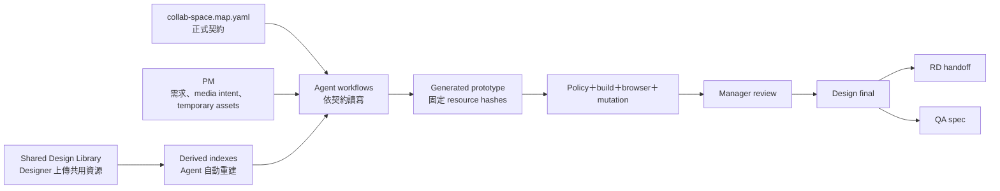
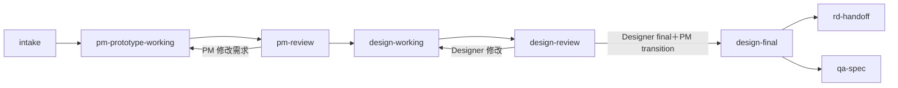

# Collab Space Contract 與 Shared Design Library 實作計畫

> **狀態：Approved plan；尚未實作。**  
> **日期：2026-08-31。**  
> **執行原則：先由 PM review 本計畫，再使用使用者選定的最高級 model 實作。**  
> **重要更正：本計畫取代尚未 commit 的 feature-level Experience Map／page asset folder 方向。**

## 1. 目標

建立一份機器可讀的 Collab Space 正式契約，讓人與 Agent 都能回答：

- 目前在什麼 stage；
- 哪個角色負責什麼；
- Source of truth 在哪裡；
- 哪個 workflow 可以修改哪些路徑；
- 哪些共用設計資源可用；
- 某個 prototype revision 實際用了哪些 tokens、components 與 media；
- 哪些資料可以公開部署，哪些只能留在 private repo／本機。

同時建立一個全域 Shared Design Library。Designer 只需在 Figma 與 Library 上傳／整理共用
資源，不需要進入每個 feature 建立圖片或影片副本，也不需要手寫 YAML、manifest 或 code。



## 2. 已確認的核心決策

| 決策 | 結果 | 判斷依據 |
|---|---|---|
| Sitemap 的含義 | 是 Collab Space 的 stage／role／artifact／path 地圖，不是單一 feature 的產品 sitemap | 目的是讓人知道怎麼使用 workspace，並讓 Agent 快速定位，不是重複 PRD／contract |
| 契約形式 | 根目錄 `collab-space.map.yaml`，機器可讀、schema-versioned | Markdown 無法單獨提供強制力或 drift detection |
| Enforcement | Agent 與 validator 立即依契約強制；人類 Git path protection 延後 | 先取得可重現行為，又不在團隊 review 前鎖死人類 workflow |
| 規則演進 | `proposed／active／deprecated`＋`info／warning／error` | 未來修改契約，不必重寫所有 validators |
| 契約 owner | PM／Collab Space Owner；其他角色可提案 | 跨角色規則需要單一流程 owner；Designer／RD仍擁有各自專業決策 |
| Shared assets | 即使 feature-specific，也集中在全域 Design Library | Designer 不必逐 feature 上傳或複製資源 |
| Asset 登記 | Designer 不寫 manifest；Feature 用自然語言要求 Agent index 指定 collection | 只有真正使用時才需要機器索引，避免上傳即產生行政工作 |
| Collection 規則 | `assets/<type>/<collection>/`；type 固定，collection 由 Designer 自訂 | 對人簡單，同時讓 Agent 能快速、安全地定位 |
| Resource selection | Collection 是候選池；每個 revision 固定實際選用檔案與 hash | Library 新增檔案不能偷偷改變已審核 prototype |
| Asset status | 新素材預設 `candidate`；design-final 前由 Designer一次確認本次 selection | 不要求逐檔寫狀態，又保留 final gate |
| PM temporary media | 放 `features/<feature>/product/mock-assets/**` | PM draft 不污染正式 Design Library |
| Temporary final gate | PM／design working 可用；design-final 不得再引用 PM mock assets | Final handoff 不能依賴未經 Designer確認的暫時素材 |
| Tokens | Global tokens 影響 working prototypes；frozen revisions 鎖定 token version | 同時符合 design-system propagation 與 review reproducibility |
| Feature token 差異 | 先用 component variant，再考慮 global variant，最後才用 feature-scoped token | 避免 token 與 component duplication |
| Token approval | Designer可標記 `prototype-active`；RD確認後為 `rd-compatible` | Prototype iteration 不被 RD卡住，handoff 前仍驗證 production 相容性 |
| Components | shared-first；缺少時允許 feature temporary；成熟後才升級 | 不複製 Button／Modal 等共用元件，也不讓新功能被 catalog 阻擋 |
| Patterns／Surfaces | shared-first；`novel` 合法；成熟後才 promote | Surface 是加速器，不是 allowlist |
| Global 更新 | 計算 affected features，不自動用 AI 批次重建；review 前強制更新／驗證 | 控制成本，避免 candidate 變更造成大量無意義 generation |
| Library Browser | 本機／private repo 可看完整 Library；public preview 不提供 | 完整 Library 可能包含未發布素材 |
| Public build | 只打包該 revision 實際選用的 resources | 避免洩漏未使用或 candidate assets |
| Indexes | `.collab-cache/**` 自動重建、不 commit | 避免 merge conflict 與 stale committed index |
| Frozen revision | 保存實際 resource paths、hashes、token／component versions | 能重現主管與 RD 實際看到的版本 |
| Stage transition | 必須自然語言明確確認；只記 transition evidence，不記主管 feedback | 保留治理證據，不增加 PM逐字整理工作 |
| Session role | PM／Designer 宣告本次角色；重要 transition 再確認；Phase 0 不做真實身分驗證 | 提供 workflow guard，但不假裝等同 GitHub access control |
| 人類操作 UX | PM／Designer以自然語言操作；CLI／YAML是 Agent、CI、maintainer 內部介面 | 主要使用者不寫 code |
| 人類文件 | 角色表、stage 表、主要流程圖由契約產生；說明文字人工維護 | 契約與文件可以做 drift check |
| 外部系統 | Figma、private GitHub、public preview、RD repo、QA-spec 都列入契約 | Agent 必須知道 handoff 方向、公開範圍與不可寫入邊界 |

## 3. 正式 stages



| Stage | 主要角色 | 主要輸入 | 可接受的未完成項目 | Exit confirmation |
|---|---|---|---|---|
| `intake` | PM | problem、scope、contract、validation、mock data、media intent | Designer final、共用元件與素材可缺 | PM 確認 Intake summary |
| `pm-prototype-working` | PM＋Agent | PM source、shared resources、temporary UI／mock assets | Candidate assets、design gaps | Functional gates 通過，PM送 review |
| `pm-review` | PM＋主管 | Frozen PM review revision | Designer final 不要求 | PM 明確確認主管允許進入設計 |
| `design-working` | Designer＋Agent | Figma、global tokens／components／assets、feature needs | Candidate resources、blocking gaps可存在 | Designer送 design review |
| `design-review` | Designer＋主管 | Frozen design review revision | 可退回多次；candidate 可存在但要標示 | Designer確認 final，PM確認 transition |
| `design-final` | Designer＋PM | Approved selection、token version、Figma reference、zero blocking gaps | 不可引用 PM mock assets | 建立 frozen design-final revision |
| `rd-handoff` | PM＋RD | Design-final revision、repo、provenance | Production backend implementation不在此 repo | PM通知 feature ready；RD取得 repo |
| `qa-spec` | PM／QA＋Agent | 與 RD相同的 design-final revision | QA執行結果不需回寫 prototype code | 產出並保留人工 YCO-spec |

`rd-handoff` 與 `qa-spec` 從同一個 `design-final` 平行發生，不互相等待。

## 4. Target repository shape

```text
yco-collab-space/
├── collab-space.map.yaml                 # 正式 control-plane contract
├── AGENTS.md                             # Agent bootstrap；指向正式契約
├── README.md
├── COLLABORATION.md                      # 人類說明；連到 generated reference
├── design-library/                       # Designer 主要 repo 工作區
│   ├── README.md
│   ├── assets/
│   │   ├── image/<collection>/
│   │   ├── video/<collection>/
│   │   ├── icon/<collection>/
│   │   ├── illustration/<collection>/
│   │   └── logo/<collection>/
│   ├── tokens/                           # 後續：Figma exports／candidate versions
│   ├── components/                       # 後續：Figma structured references
│   ├── patterns/                         # 後續：Designer-approved design rules
│   └── decisions/                        # 後續：global design decisions
├── features/
│   ├── _template/
│   └── <feature>/
│       ├── product/
│       │   ├── intake.md
│       │   ├── prd.md
│       │   ├── prototype.contract.yaml
│       │   ├── surface-intent.yaml
│       │   ├── validation.yaml
│       │   ├── media-intent.yaml          # Agent由 PM自然語言維護
│       │   ├── mocks/
│       │   └── mock-assets/               # PM temporary media
│       │       ├── image/
│       │       ├── video/
│       │       └── other/
│       ├── design/
│       │   ├── design.ref.json
│       │   └── design-gaps.yaml
│       │   # 長期 feature design record schema 待真實 Designer pilot 決定
│       ├── generated/
│       │   ├── feature.jsx
│       │   ├── feature.module.scss
│       │   └── generation.json            # 暫存 exact resource selection／hashes
│       ├── evidence/
│       └── releases.json                  # stage transitions／frozen revisions
├── platform/                              # Prototype 可執行共用層
│   ├── runtime/                           # Shell、routing、review infrastructure
│   ├── ui/                                # Shared React components
│   ├── surfaces/                          # Shared executable compositions
│   └── tokens/
│       ├── rd/                            # Immutable current RD baseline
│       ├── active.css                     # 後續：只指向已啟用 token version
│       └── tokens.lock.json
├── app/                                   # Public prototype application
├── tools/
│   ├── collab-space/                      # Contract、policy、index、docs generators
│   ├── design-library/                    # Scanner、query、local browser
│   ├── prototype-cli/
│   ├── validation/
│   └── evaluation/
├── docs/
│   ├── generated/                         # 由 contract 產生並接受 drift check
│   └── architecture/
└── .collab-cache/                         # ignored；所有 index 可重建
    ├── features-index.json
    └── design-library-index.json
```

`design-library/tokens／components／patterns` 先建立邊界與說明，不在第一個 slice 發明尚未經
Designer／RD確認的 schema。不要用空的假 catalog 宣稱 Phase 1 foundation 已完成。

## 5. `collab-space.map.yaml` 契約模型

第一版契約至少描述：

```yaml
schemaVersion: 1
status: active
owner: pm-collab-space-owner

actors:
  pm: {}
  designer: {}
  rd: {}
  qa: {}
  agent: {}
  manager: {}

stages:
  intake:
    allowedActors: [pm, agent]
    requiredArtifacts: []
    writablePaths: []
    exitConfirmation: pm
    enforcement: error

artifacts:
  pm-product-source: {}
  shared-design-assets: {}
  generated-prototype: {}
  frozen-revision: {}
  qa-spec: {}

systems:
  figma: {}
  private-github: {}
  local-workspace: {}
  public-preview: {}
  rd-repository: {}
  yco-spec: {}

indexes:
  features: .collab-cache/features-index.json
  designLibrary: .collab-cache/design-library-index.json

rules: []
```

正式 schema 要求所有規則有 stable ID、status、enforcement、actor、stage、source／target path、
decision basis。Validator 必須是通用 policy engine；不得把每一條 role/path 規則分散硬編碼在
多個 CLI 裡。

### 5.1 Enforcement levels

| Level | 行為 |
|---|---|
| `info` | 顯示導覽與建議，不影響 workflow |
| `warning` | 產生明確報告；允許 temporary／working 流程繼續 |
| `error` | 阻擋 generation、review、final 或 handoff |

### 5.2 Rule lifecycle

| Status | 行為 |
|---|---|
| `proposed` | 文件可顯示，不執行 hard gate |
| `active` | 依 enforcement 執行 |
| `deprecated` | 顯示 replacement；新 workflow 不得引用 |

### 5.3 Contract change

PM／Designer／RD可用自然語言提案。Agent先顯示 stage、role、path、validator、文件與 migration
影響；只有 Collab Space Owner 確認後才更新 active contract。更新後必須重建 generated docs、
執行 schema、policy、drift、mutation tests。

## 6. Shared Design Library 行為

### 6.1 Designer upload flow

Designer只需用 Finder、GitHub 或既有設計交付方式，把 web-ready files 放入：

```text
design-library/assets/<type>/<collection>/
```

不要求：

- 逐檔 manifest；
- 手寫 asset ID；
- 執行 npm；
- 進入 feature folder；
- 上傳時通知 Agent；
- 指定當下要給哪個 feature 使用。

若沒有 feature 引用，新檔案可留在 Library，不會阻擋 PM prototype，也不會進 public build。

### 6.2 Feature usage flow

PM／Designer對 Agent說：

> 請在 Image Relight index `assets/video/dance`。

Agent依序：

1. 從正式契約定位 Design Library；
2. 只掃指定 collection，不搜尋整個 repo；
3. 顯示候選檔案與可預覽資訊；
4. 檢查 safe path、格式、重複名稱、missing／broken file；
5. 依 stage 與角色讓 PM／Designer確認實際 selection；
6. 生成 prototype；
7. 把 exact path、SHA-256、collection、status 與使用目的寫入 `generation.json`；
8. build 只 import selected files。

Designer日後新增 collection file，只會讓 working feature 出現「collection changed」提示；不會
改變舊 selection 或 frozen revision。下一次 update 才能選擇新素材。

### 6.3 Candidate／approval

- 新上傳素材預設 `candidate`；不需要 Designer逐檔確認。
- PM temporary、design-working、design-review 可使用 candidate，但 evidence 必須顯示狀態。
- 進入 `design-final` 前，Agent列出實際 selection，Designer一次自然語言確認。
- Agent記錄 selection approval，而不是要求 Designer修改 catalog。

### 6.4 Rename／delete protection

Derived index 建立 reverse references：asset → working／review／final revisions。

- Unused：可移除／改名。
- Working-only：warning，Agent可協助建立新 selection。
- Frozen review／final：不得靜默破壞；要顯示 affected revisions 並建立新 revision。
- 舊 frozen version 依 Git revision／tag 保持可重現，不在 current working tree 複製多份 binary。

### 6.5 PM temporary assets

PM只在缺少合適 shared resource 時使用：

```text
features/<feature>/product/mock-assets/**
```

這些檔案：

- 是 PM source；
- 一律標記 temporary；
- 可用於 PM review 與 design working／review；
- 不自動 promote 到 Design Library；
- design-final selection 不得引用；
- Designer若保留，需把 final export 放進 global Library，再由 Agent更新 selection。

## 7. Tokens、components、patterns 的 layering

### 7.1 Tokens

```text
Figma export／Designer source
design-library/tokens/<version>/
        ↓ validate／activate
platform/tokens/active.css
        ↓ consume
working prototypes
```

- `platform/tokens/rd/**` 保持目前 immutable evidence，不由 Designer覆寫。
- Designer確認的新 global version 可成為 `prototype-active`。
- RD相容性確認後標記 `rd-compatible`；design-final／handoff 需要此狀態。
- Working prototypes 跟隨 active global version並標記 evidence stale。
- Frozen manager-review／design-final revision鎖定原 version與 hash。
- 單一 feature 差異先使用 component variant，再考慮 shared variant，最後才使用 feature-scoped
  token。Feature-scoped token 的 repository schema 待 Designer／RD pilot 決定。

### 7.2 Components

- Figma／design source 與 React implementation 分層。
- Agent先查 shared component catalog／`platform/ui`。
- 缺少時 PM temporary prototype 可在 feature generated code 使用 temporary component。
- Designer判斷是否只屬於 feature；可重用時由 Designer＋RD確認後 promote。
- Feature不得只因小型外觀差異複製 shared component；先用 props／variant／token。

### 7.3 Patterns／Surfaces

- Agent先查 shared patterns／Surface Packs。
- `reuse／hybrid／novel` 都是合法策略。
- Novel 不阻擋 PM review。
- 首次出現的 layout 保持 feature-specific；經 Designer／PM／RD review 才 promote。

## 8. Local-only Design Library Browser

建立唯讀瀏覽器，讓非技術使用者看到：

- asset types 與 collections；
- thumbnails／video preview；
- collection path 與 file count；
- candidate／approved usage status；
- working／review／final feature references；
- format、missing poster、broken file 等 warnings；
- 可複製的自然語言使用範例。

### Public isolation hard requirement

Library Browser 不可只是用 CSS 隱藏或 route guard。Public Vite build 必須在 module graph 與輸出
assets 層完全排除完整 Library：

- Local browser 使用獨立 entry／dev-only server；
- Public app 不得 `import.meta.glob` 整個 Design Library；
- Public build只以 static imports 打包 selected resources；
- Test 檢查 build manifest／dist 不含 unselected fixture filenames；
- Public `/design-library/` 必須 404 或回到一般 prototype shell，不得列出 catalog。

## 9. Index strategy

### 9.1 Derived caches

```text
.collab-cache/features-index.json
.collab-cache/design-library-index.json
```

- 不 commit；加入 `.gitignore`。
- Agent workflow 開始時自動刷新需要的 index。
- Cache 缺少時自動重建，不要求 PM／Designer執行 CLI。
- Feature query 先讀 root contract，再讀 feature cache；asset query只掃指定 collection。
- Cache 不是 source of truth；真相是 committed source files與實體 Library files。

### 9.2 Committed revision provenance

`generation.json` 暫時保存：

- requested collections；
- selected relative paths；
- SHA-256；
- asset type／candidate status；
- PM mock vs Design Library source；
- token version／hash；
- shared component／Surface versions；
- generator／adapter version；
- session role與確認 stage；
- source input hash。

長期 `media-selection／token-selection／component-selection` 是否拆成 feature design source，標記
為 `proposed`，等第一個 Designer pilot 後再決定，本 slice 不寫死。

## 10. Natural-language UX

PM／Designer主要使用方式是對 Agent說需求，不操作 YAML／CLI。

PM例子：

> 建立 Image Relight prototype，先使用共用 portrait images；如果沒有合適結果圖，請產生暫時 mock image。

> 請 index `assets/video/dance`，本次選三支不同舞蹈風格的影片。

Designer例子：

> 我已經把新影片放到 `assets/video/dance`，請列出 Image Relight 下次 update 可用的新素材。

> 請用新版 Figma tokens 建立 candidate version，不要先影響其他 working prototypes。

> 這次 design review 選用的素材可以作為 final。

Agent內部仍可執行 CLI，供 CI、RD與除錯使用；CLI不應成為 PM／Designer onboarding 主流程。

## 11. Contract-driven enforcement loop

不是把決策只寫在 Markdown，而是：

```text
Contract
→ JSON Schema
→ Generic policy evaluator
→ Workflow action
→ Source-boundary／resource／stage validators
→ Build
→ Browser validation
→ Mutation evaluation
→ CI verdict
```

| 決策類型 | 技術強制方式 |
|---|---|
| Role／stage／path | Contract policy evaluator＋source snapshot |
| Required artifacts | Schema＋cross-reference validator |
| Asset scope／selection | Safe collection query＋exact hash provenance |
| Public isolation | Separate build entry＋dist inspection test |
| Token／component versions | Version lock＋affected-feature calculation |
| Frozen revision | Git revision／release metadata＋resource hashes |
| Stage transition | Explicit confirmation＋transition state machine |
| Human-only design judgment | Designer／PM confirmation＋audit，不偽裝成 deterministic test |
| 文件一致性 | Contract-generated reference＋drift check |

## 12. Migration plan

### M0 — Preserve and classify the current dirty worktree

目前上一版 feature-map migration 尚未 commit。執行 Agent 必須先：

1. 讀取完整 `git status`／diff；
2. 確認哪些變更屬於上一版錯誤方向；
3. 不使用 `git reset --hard`、`git checkout --` 或廣泛刪除；
4. 以精準 patch 移除錯誤 additions，保留不相關的使用者變更；
5. 在建立新架構前恢復 Phase 0.5 baseline gates。

需要移除的錯誤概念包括：

- `product/experience-map.yaml`；
- `design/pages/<page-id>/**`；
- feature-level `design/manifest.yaml`；
- `design:scaffold`／page-oriented `design:query`；
- experience／page-design schemas與 policy；
- generated DOM 的 `data-page-id／data-page-section`要求；
- rendered／mutation checks 中的 feature sitemap assumptions；
- generation metadata中的 feature experience-map欄位；
- 把 `platform/design-system/index.yaml` 當成已完成 global catalog 的上一版文件描述。

不要移除原本已存在且仍需要的：

- PM Intake／PRD／prototype contract／validation／mocks；
- Surface reuse／hybrid／novel；
- RD token baseline與 lock；
- source mutation guard；
- build、rendered、workflow、mutation evaluation；
- QA人工 YCO-spec requirement；
- `platform/runtime／ui／surfaces` 的既有功能。

### M1 — Contract schema first

- 先建立 failing tests：invalid stage transition、unknown actor、overlapping path rules、missing decision basis、invalid external-system direction。
- 新增 `collab-space.map.yaml` schema。
- 建立最小 active contract，忠實表達已確認 stages／roles／systems。
- Contract validator 只讀，不先改 workflow。

**Exit:** valid contract passes；seeded invalid contracts fail with readable messages。

### M2 — Generic policy evaluator

- 將硬編碼的 Agent write boundaries 對接 contract。
- 保留 domain-specific validators；不要為了資料驅動把所有語意塞進 YAML。
- 支援 info／warning／error與 proposed／active／deprecated。
- 支援 session role與 stage transition preflight。
- 目前只對 Agent／validator error enforcement；人類 Git enforcement 保持 warning。

**Exit:** 相同 validator能以 fixture contract改變 allowed paths，不需修改程式條件式。

### M3 — Design Library scanner and safe query

- 建立 root `design-library/` 與人類 README。
- Scanner只接受固定 type＋collection結構。
- Query拒絕 traversal、symlink escape與 repository外路徑。
- 產生 ignored cache，包含 path、type、collection、size、hash與可可靠取得的 media metadata。
- Feature command只掃指定 collection。
- 新增 reverse-reference calculation。

**Exit:** Designer放入檔案後不需 manifest；Agent可 index指定 collection；全 repo search不是正常路徑。

### M4 — PM media intent and selection provenance

- Feature template加入 `product/media-intent.yaml` 與 `product/mock-assets/`說明。
- Intake adapter從自然語言更新 media intent；PM不手寫 YAML。
- Update workflow解析 requested collections、顯示候選、固定 selection。
- `generation.json`加入 exact resources／hashes。
- Input hash涵蓋 media intent、selected Library files與 PM mock assets。
- 新增 affected／stale判定，但不自動呼叫 AI重建所有 features。

**Exit:** Collection新增檔案不改舊 revision；下次 update顯示新候選；selected file改變會使 working evidence stale。

### M5 — Stage and frozen revision policy

- 把 confirmed stage graph加入 state machine。
- 延伸 `releases.json`保存最小 transition evidence，不記主管 feedback。
- Review／final transition要求明確自然語言確認與 session-role reconfirmation。
- `design-final`阻擋 PM mock asset references、unapproved selected media、非 `rd-compatible` token version與blocking gaps。
- RD handoff與QA-spec共同讀design-final revision。

**Exit:** Build PASS不能自行 promote；錯誤角色／非法 transition被阻擋；兩個下游取得同一 revision hash。

### M6 — Local Design Library Browser

- 建立獨立 local-only entry／server。
- 顯示 visual collection gallery、warnings、references與copyable natural-language prompts。
- 不提供寫入 UI；所有修改仍由 Designer上傳與Agent自然語言workflow完成。
- 建立 public exclusion tests。

**Exit:** 本機可預覽完整 Library；public build中找不到未選用 asset bytes／filenames／routes。

### M7 — Generated collaboration reference

- 從 contract產生 `docs/generated/collab-space-reference.md`。
- 產生 stage table、role matrix、path map、external-system flow與enforcement summary。
- `COLLABORATION.md`保留 beginner explanation並連到generated reference。
- `docs:check`在CI比較重建結果；drift即fail。

**Exit:** 修改 contract 未重建人類 reference時，CI可抓到。

### M8 — Agent adapters and beginner UX

- `AGENTS.md`要求任何 Agent先讀 root contract。
- Claude／Codex adapters共用一份agent-neutral workflow，不複製政策文字。
- Intake／Update／Design Review先做role、stage、index preflight。
- 文件主流程只給自然語言例子；CLI移到maintainer section。
- 不 hard-code model vendor；主模型由使用者選擇，subagent policy另行設定。

**Exit:** PM／Designer可完成vertical slice而不直接編輯YAML或執行npm。

### M9 — Evaluation and pilot

- Unit／schema／policy tests。
- Mutation suite證明graders抓得到contract、asset、stage、public-isolation錯誤。
- Browser tests驗證prototype與local Library Browser。
- Isolated workflow eval驗證source boundaries與reproducibility。
- 第一個真實PM feature作cutover pilot；Designer加入後再決定長期feature design record schema。

## 13. Test plan

### 13.1 Contract／policy tests

- Unknown actor／stage／artifact fails。
- Illegal transition fails。
- Active error rule blocks；proposed rule不hard-block。
- Agent在Update修改PM／Designer source fails。
- 改fixture contract即可改write boundary，validator程式不變。
- External system方向正確：Collab Space不寫RD repo、不讀production secrets。

### 13.2 Library tests

- `assets/video/dance/*.mp4`被指定query找到。
- 未被指定的collection不被掃入feature selection。
- Path traversal／symlink escape fails。
- Duplicate／unsupported／missing selected file fails。
- Collection新增檔案不更改既有selection。
- Selected file內容改變造成hash mismatch／stale。
- Rename／delete顯示affected features與frozen references。
- Designer不提供manifest仍可index。

### 13.3 Temporary／final tests

- PM mock asset可進PM review。
- Design working／review可帶temporary warning。
- Design-final引用`product/mock-assets/**` fails。
- Candidate selection沒有Designer final confirmation fails final gate。
- Build PASS不能自動改stage。

### 13.4 Token／shared-resource tests

- Working prototype active token change → affected／visual evidence stale。
- Frozen revision仍保存原token version／hash。
- Feature scoped change不污染其他feature。
- Shared component存在時，生成不得複製同ID temporary component。
- Novel Surface仍可進PM review。

### 13.5 Public isolation tests

- Local Library Browser能看到fixture collection。
- Public build沒有Library Browser route。
- `dist/**`不含unselected fixture filename／hash／bytes。
- Public prototype只載入selection中列出的local assets。
- 無Figma、Drive、production CDN或external runtime requests。

### 13.6 Documentation／evaluation tests

- Generated collaboration reference與contract一致。
- Seeded docs drift被抓到。
- Mutation suite至少包括：contract bypass、wrong stage、wrong actor、unselected asset bundled、
  PM mock asset in final、resource hash drift、frozen revision mutation。
- Rendered checks維持configured viewports、console-clean與mock-only network guard。

## 14. Definition of Done

第一個 corrected vertical slice只有在以下全部成立才完成：

- 上一版feature Experience Map／page asset architecture已精準移除，沒有兩套sitemap並存；
- `collab-space.map.yaml` schema-valid，包含confirmed stages、roles、paths、systems、decision basis；
- Agent／validator write boundaries由contract驅動；
- Designer可只上傳到`design-library/assets/<type>/<collection>/`，不寫manifest／code；
- PM／Designer可用自然語言要求Feature index collection；
- Revision保存exact selected files與hashes；
- Library新增檔案不會改變frozen revision；
- PM temporary assets有明確位置且被design-final gate阻擋；
- 本機Library Browser可使用；public build完全排除完整Library；
- Global resource變更只標記affected，不自動批次AI重建；
- Working與frozen token version行為有tests；
- Stage transition需要explicit confirmation且留下minimal audit；
- RD handoff與QA-spec讀相同design-final revision；
- 角色表、stage表與主要flow由contract產生並通過drift check；
- Unit、schema、policy、build、browser、mutation、isolated workflow evaluation全部PASS；
- 一個真實PM feature完成PM temporary path；Designer pilot可在不改架構的前提下加入。

## 15. 明確 deferred items

下列項目不可在本次實作中由Agent自行定義：

- 長期feature design record要一份檔或多份檔；
- Figma token export的正式格式、plugin／API與version naming；
- Feature-scoped token repository schema；
- Designer／RD canonical component catalog完整schema；
- SVG安全轉換、media size budgets、licence、caption／transcript policy；
- CODEOWNERS、GitHub protected paths與真正角色驗證；
- Protected preview authentication；
- 自動promotion／release tag細節；
- YCO-spec adapter實作；既有QA人工spec需求仍必須保留；
- 將所有RD components或歷史projects一次migration。

Deferred 不代表遺忘：契約中使用 `proposed`／warning，等Designer／RD pilot有實際證據後再升級。

## 16. 執行時的安全規則

- 先讀本計畫、`AGENTS.md`、root contract與最新git diff。
- 不使用destructive git commands清理上一版變更。
- 不碰private GitHub／Vercel deployment，除非PM另行要求。
- 不搬入RD production runtime、API、auth、CMS、Redux、analytics或secrets。
- 不因Design Library存在就將所有assets打包進public app。
- 不要求PM／Designer手寫machine files。
- 同一acceptance criterion兩種修正仍失敗時，停止第三次patch並重新評估設計。
- 每個新增hard gate都要有negative／mutation case證明它真的會抓錯。

## 17. 建議執行順序與review checkpoints

| Checkpoint | 完成內容 | PM要review什麼 |
|---|---|---|
| A | M0錯誤方向撤回 | Git diff只移除feature sitemap概念，原Phase 0.5仍PASS |
| B | M1–M2 contract＋policy | Stage／role／path表是否符合團隊語言；未來規則是否可由data調整 |
| C | M3–M4 Library index＋selection provenance | Designer上傳與PM自然語言使用是否夠簡單 |
| D | M5 stage／final gates | Review／final／handoff責任與阻擋條件是否正確 |
| E | M6–M7 Browser＋generated docs | 非技術使用者能否找到collection與理解流程 |
| F | M8–M9 adapters＋evaluation | PM不用CLI能否跑完一個真實temporary prototype |

每個checkpoint先提供diff、tests與可操作證據，再進下一個；不要一次完成全部後才讓PM驗收。

## 18. M0 精準撤回清單

此表是執行時的起始 inventory，不取代當時重新檢查 Git diff。若檔案在執行前已被使用者修改，
必須先保留使用者內容並重新判斷，不可照表盲刪。

### 18.1 上一版新增、預期移除

```text
docs/architecture/2026-08-31-experience-map-design-registry.md
features/_template/product/experience-map.yaml
features/_template/design/manifest.yaml
features/_template/design/pages/**
features/collab-space-readiness/product/experience-map.yaml
features/collab-space-readiness/design/manifest.yaml
features/collab-space-readiness/design/pages/**
platform/design-system/index.yaml
tools/prototype-cli/design-registry-policy.mjs
tools/prototype-cli/design-registry-policy.test.mjs
tools/prototype-cli/query-design.mjs
tools/prototype-cli/scaffold-design.mjs
tools/prototype-cli/validate-design.mjs
tools/prototype-cli/validate-intake.mjs
tools/prototype-cli/schemas/design-manifest.schema.json
tools/prototype-cli/schemas/design-system-index.schema.json
tools/prototype-cli/schemas/experience-map.schema.json
tools/prototype-cli/schemas/page-design-manifest.schema.json
```

### 18.2 既有檔案中只撤回 feature-map 相關 hunks

| 檔案 | 撤回內容 | 後續 corrected replacement |
|---|---|---|
| `package.json` | `design:scaffold／design:query／validate:design`與錯誤intake chain | 後續加入contract／library內部commands |
| `tools/prototype-cli/validate-inputs.mjs` | Experience Map schema／semantic dependency | 後續讀Collab Contract與media intent |
| `tools/prototype-cli/record-generation.mjs` | Feature experience-map／page registry metadata | 改存exact selected resources／hashes |
| `tools/validation/run-rendered-checks.mjs` | `data-page-id／data-page-section`要求 | 保留原Surface／functional／viewport checks |
| `tools/prototype-cli/schema-policy.test.mjs` | Experience/page manifest cases | 改成Collab Contract／media intent cases |
| `tools/evaluation/run-mutation-suite.mjs` | Experience folder／page section／unmanifested page asset mutations | 改成contract／collection／public isolation mutations |
| `features/collab-space-readiness/generated/feature.jsx` | `data-page-*` anchors | 不改其他readiness UI |
| `features/collab-space-readiness/generated/generation.json` | Experience/page registry provenance | 重建為corrected provenance |
| `AGENTS.md` | 要求Agent讀feature Experience Map／page manifests | 要求先讀`collab-space.map.yaml`與derived indexes |
| `README.md`、`COLLABORATION.md` | Feature page scaffold／query操作 | 改成人類自然語言＋Shared Library流程 |
| Architecture／scope／Designer guide | Feature-local assets是主流程的描述 | 改成global Library＋PM temporary exception |

完成撤回後先執行原Phase 0.5 gates，確認baseline恢復，再進M1。M0本身不得順便實作新架構，
如此若後續contract slice失敗，仍有清楚、可運行的中間狀態。
