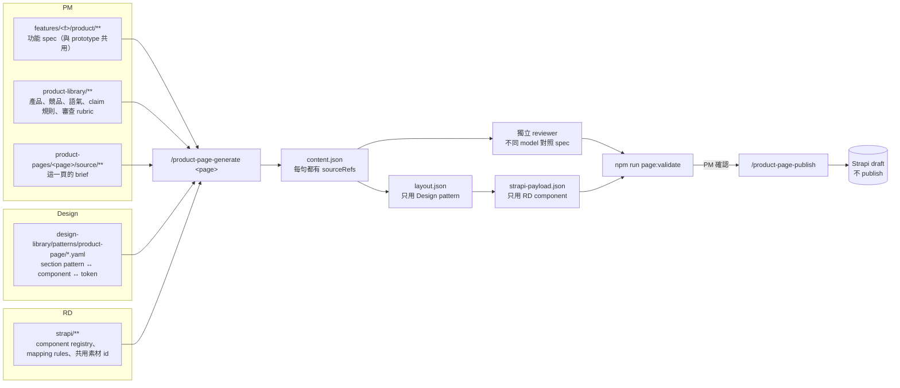
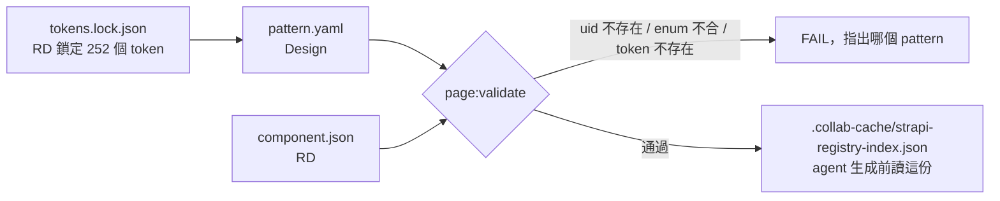
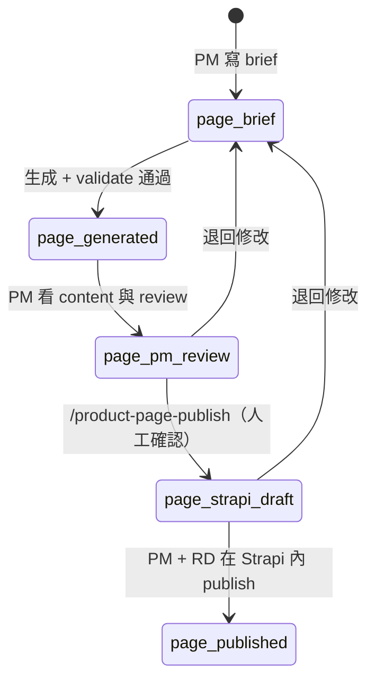

# 產品頁生成器：給 Design 與 RD 的討論說明

日期：2026-09-02 ｜ 狀態：已實作在分支 `feat/product-page-track`，等三方確認後才合併 main
細節設計：`docs/architecture/2026-09-02-product-page-generator-plan.md`
待辦與執行：`docs/handoff/2026-09-02-product-page-opus-handoff.md`

## 1. 要解決什麼

每做一頁產品頁，都要有人把 PM 的 spec、Design 的版型與 token、RD 支援的 Strapi component
手動翻成 Strapi 內容。目標是：三方各維護自己的資料夾，任何人跑同一個指令，就能從 spec
生成一頁 Strapi draft；生成的內容不能超出 PM spec。

## 2. 一張圖



## 3. 誰管什麼

| 角色 | 只改這裡 | 提供什麼 | 改了之後 |
|---|---|---|---|
| PM | `features/<f>/product/**`、`product-library/**`、`product-pages/<p>/source/**` | spec、產品與競品資料、語氣與 claim 規則、審查 rubric、頁面 brief | 下次生成自動採用 |
| Design | `design-library/patterns/product-page/**`、`design-library/skills/**` | 每種 section 長什麼樣、允許哪些排版選項、用哪些 token、文案多長、素材規格 | 下次生成自動採用 |
| RD | `strapi/**` | component uid 與欄位、enum、共用素材 id、payload 轉換規則、push 工具 | 失效的 pattern 與舊產物立刻被 validator 標出 |
| Agent | `product-pages/<p>/generated/**` | content、layout、payload、review、輸入 hash | 任何輸入變動就 stale |

規則寫在 `collab-space.map.yaml`，靠路徑所有權隔離，不靠「誰按指令」。

## 4. Design 與 RD 怎麼接起來

一個 pattern 檔就是一個綁定點，Design 寫視覺，RD 的 registry 決定它能不能成立：

```yaml
# design-library/patterns/product-page/use-case-alternating.yaml
strapiComponent: apps-page.section-be-af-image      # 必須在 strapi/registry.yaml
layoutOptions:
  textPosition: { values: [left, right], default: alternate }   # 只能用 component 的 layoutFields 與 enum
tokens:
  title: { fontSize: --font-size-heading-2, color: --text-strong }  # 必須在 tokens.lock.json
copy:  { title: { maxChars: 60 } }
media: { sectionBeAfMedia.imageBeforeDesktop: { required: true, aspectRatio: "4:3" } }
```



目前的綁定（7 個 pattern，全部 `status: provisional`）：

| Pattern | Strapi component | 用在 |
|---|---|---|
| hero-banner | product-page.top-banner | 首屏 |
| intro-rich-text | product-page.rich-editor | 開場說明 |
| section-heading | product-page.rich-editor | 群組標題 |
| feature-highlight | apps-page.section-be-af-image | 功能亮點 |
| how-to-steps | product-page.section-steps | 操作步驟 |
| use-case-alternating | apps-page.section-be-af-image | 左右交替的使用情境 |
| faq | apps-page.section-faq | FAQ |

## 5. 生成後有哪些關卡



| 關卡 | 抓什麼 |
|---|---|
| 來源檢查 | 每句 claim 都要指到 spec 或 product-library 的真實段落；競品檔不能是能力的唯一來源 |
| 結構檢查 | 自創 component、enum 外的排版值、未鎖定的 token、超過字數、缺必填、出現 `publishedAt` |
| 獨立 review | 另一個 model 依 rubric 逐句對照 spec，寫 `review/spec-compliance.json`；有 blocker 就擋 |
| 輸入 hash | 任一角色的輸入改了，舊產物就不能往下推 |
| Source guard | 生成過程若偷改 spec、pattern、registry，`page:update:check` 立刻 FAIL |
| 階段核准 | 每次往下推都綁 evidence hash；有 mock 素材或沒有 publish 紀錄就不能推 |

## 6. Fixture 已經跑過一次

頁面：AI Character Motion Transfer。8 個 section、39 個 token、3 個共用素材 id 全部通過
`npm run build` 與 48 個測試。獨立 reviewer（Opus，builder 是 Fable）給 `pass-with-notes`：

- major：SEO 的 4.9 / 129,294 評分，引用的來源本身註明「PM 重新確認前不可再用」。
- minor：SEO meta title 用了非正式名稱「AI Motion Transfer」。

這兩點留給 PM 決定，內容沒有動。真實 Strapi 尚未打過，push 只跑過 dry run。

## 7. 要請 Design 確認

1. 7 個 pattern 的 token 對不對 Figma，特別是 hero 假設深色背景用 inverse 文字。
2. 素材規格：hero 2880×1254、use case 4:3、影片 mp4 多 dpi，是否符合現行規範。
3. 文案上限（hero 標題 40 字、描述 160 字、按鈕 24 字、section 標題 60 字）是否可接受。
4. 是否還需要其他 section pattern（例如比較表、定價、評價牆）。
5. 影片素材上傳到 `design-library/assets/video/ai-motion-transfer`。

## 8. 要請 RD 確認

1. 巢狀 component 的 uid（目前標 `inferred`）對照 Strapi schema。
2. `backgroundColor`、`Layout`／`layout`、`buttonType` 的完整 enum。
3. 更新既有 entry 時是否要保留巢狀 `id`；目前 create 一律移除。
4. `/upload` 是否接受 admin JWT；若只接受 API token，改用 `STRAPI_ADMIN_TOKEN`。
5. 自動化只建 draft，多語系仍交 n8n 既有流程，這個邊界是否 OK。
6. 提供測試環境的 `.env`（依 `strapi/client/.env.example`，不進 repo）。

## 9. 要請 PM 決定

1. 評分要重新確認後再用，還是先拿掉。
2. SEO title 是否改用官方名。
3. `product-library/messaging/*` 與審查 rubric 草稿是否照這樣用。
4. 補真實限制（clip 長度、解析度、credits）到 prd，讓頁面能寫。

## 10. 指令

```bash
npm run page:validate -- --page ai-motion-transfer   # 全部關卡
npm run page:binding                                  # component ↔ pattern ↔ token 綁定表
npm run page:publish -- --page ai-motion-transfer     # dry run，不打 API
/product-page-generate ai-motion-transfer             # 在 Claude Code 內重新生成
```
