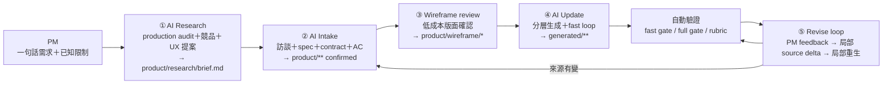

# AI Spec／Mockup 生成流程優化 Review

- 日期：2026-09-16
- 範圍：PM → AI Intake → AI Update → 自動驗證 這一段。Designer／RD 的 platform、design-library、rd-baseline 不在本文修改範圍。
- 依據：`AGENTS.md`、`COLLABORATION.md`、`collab-space.map.yaml`、三個 workflow 文件、`tools/**` 驗證器、`evals/**`、以及唯一一個完整走過流程的真實 feature `features/cloud-storage`（含 `docs/research/2026-09-14-cloud-storage-competitive-ux.md`）。
- 狀態：**已實作（2026-09-16）。** Owner 核准第 6 節 Q1–Q9 全部，並加一條：sub-agent 的 validator 與 reviewer 必須同時支援 OpenAI 模型（團隊也用 Codex）。實作紀錄與待本機驗證的項目見第 8 節。

---

## 0. 一句話結論

驗證層（deterministic gates、provenance、mutation suite、rendered check）已經很扎實；真正的瓶頸在「驗證之前」：Intake 沒有把研究、UX 提案、spec 拆成獨立階段與 artifact，所以高品質的部分（cloud-storage 的競品研究、wireframe layout review）都是 ad hoc 做的，無法重複；而 Update 每一輪都把整個 feature 的來源與產出重讀重寫，四輪 PM review 就是四次全量重生成，這是成本的主要來源。

建議把流程改成 **5 個各有 artifact 與 gate 的階段**，並用 Claude Code 的 harness（CLAUDE.md context pack、hooks、sub-agent、fast loop、intake rubric eval）把「規則靠 AI 自律」改成「規則靠工具強制」。

---

## 1. 現況：哪些已經做對

| 能力 | 證據 | 評價 |
|---|---|---|
| 來源邊界機器可讀 | `collab-space.map.yaml` workflows 的 `writablePaths`／`protectedPaths`，`source-guard.mjs` snapshot／check | 正確的設計，但目前只在 update **結束後**檢查，不是在寫檔當下阻擋 |
| 元件強制查表 | `library:components` + `surface-intent.yaml componentReuse[]` + `componentReuseErrors` | 是這個 repo 最有價值的品質機制；cloud-storage 的 35 個 role 全部有 reuse evidence |
| 產出可稽核 | `generation.json` schema v3：input hash、component hash、資源 hash、integrity | 完整，但 cloud-storage 的 `adapter`／`model` 都是 `not-recorded`，代表 14 步手動流程沒有被完整執行 |
| 驗證器可自證 | `eval:mutations` 17 個 mutation，每個 grader 都要抓到 | 好；但全部針對 generated／platform，**沒有一個針對 Intake 品質** |
| 真實 Intake 品質 | cloud-storage 的 intake.md、decisions.md 把每個決策綁到競品證據與 RD audit | 品質高，但這份品質來自 PM 與 AI 的臨場發揮，workflow 文件裡沒有「競品分析」「production audit」「wireframe review」這三步 |

---

## 2. 問題清單

依對「品質」與「成本」的影響排序，每條附證據。

### P1 — Intake 缺少「研究→提案」階段，競品分析與 UX 建議沒有落點

- `agent-adapters/workflows/prototype-intake.md` 第 5 步只列了訪談題組，沒有競品研究、production surface audit、UX 提案、一致性檢查。
- cloud-storage 的競品研究是 PM 用自己帳號登入四家競品、由 AI 逐頁操作做出來的（`docs/research/2026-09-14-…md` 第 0 節），放在 `docs/research/` 而不是 feature 目錄；`collab-space.map.yaml` 的 artifacts 沒有這個東西，`validate:intake` 也不知道它存在。
- 結果：下一個 feature 要不要做研究、做到什麼深度、證據等級怎麼標，全看當時的 AI 與 PM。無法評估、無法重複。

### P2 — 每次 Update 都是全量重讀＋全量重寫，PM review 每一輪都付一次全額

- cloud-storage 的 product 來源合計約 2,600 行（contract 365、validation 840、i18n 548、decisions 312、surface-intent 216、prd 175、intake 95），generated 約 3,100 行（index.jsx 1,740）。依 workflow 第 2 步，每次 update 全部讀一遍，估計 60–90k input tokens 才開始寫；重寫 index.jsx 一次約 20k output tokens。
- `decisions.md` 有 7 個 `##` 段落，後面四段是「Layout review 09-15」「Follow-up 09-15」「Capacity and toolbar review 09-16」「second pass」「third pass」，並註明「replace earlier entries above」。AI 每次要自己推斷哪條決策還有效——這是品質風險也是 token 浪費。
- 沒有「PM feedback → 局部修改」的 workflow。目前只有 `prototype-update`（全量）一條路。

### P3 — 驗證 loop 太重，不適合修錯迭代

- `npm run build` = 13 個 validate gate + vite build + **storybook build** + public-build check；`test:rendered` 再起 preview server 跑 3 個 viewport。單一 feature 改一個 selector 也要跑全套。
- `run-rendered-checks.mjs` 沒有 `--check <id>` 或 `--viewport`，只能整份 validation.yaml 重跑。
- 沒有 fix-loop 的上限與停止條件；AI 在「跑 → 讀 log → 改 → 跑」時每輪都把完整 log 吃進 context。

### P4 — 規則靠 AI 讀文件自律，沒有 hook 強制

- `.claude/settings.json` 不存在，沒有任何 hook。「Intake 不得動 generated/**」「Update 不得動 product/**」「不得寫 raw colour」都只寫在 md 裡。
- `source-guard check` 在 update 結尾才跑；AI 若中途改了 product 檔，是整輪工作作廢，而不是當下被擋。
- provenance 沒記到 model（cloud-storage）就是「靠自律」失敗的實例。

### P5 — Intake 沒有品質評估

- `evals/cases/` 只有 readiness fixture 的 regression；`visual-surface-rubric.md` 是視覺的、human-required。
- 沒有針對「Review goal 是否可被主管判斷」「AC 是否可測」「每個決策是否有 decision basis」「open decisions 是否真的為 None」的 rubric，也沒有 LLM judge。
- `validate:intake` 只檢查 markdown 段落標題存在與 AC↔check 對應。

### P6 — 已知的平台契約衝突擋住 1/30 rendered check（DESIGN-019）

- `layoutIntent.componentRoles` 被兩個工具用相反語意讀：`validate:intake` 要求列全（composition），`run-rendered-checks` 要求每個都在每個 viewport **可見**（at rest）。modal、breadcrumb、hover menu 永遠不可能同時滿足。
- surface-intent.yaml 裡用一段 500 字的 decisionBasis 解釋這件事，是 AI 每次都要重讀的成本。

### P7 — 小的流程不一致，累積成摩擦

- `i18n.json` 不能在 Intake 寫，因為 validator 拒絕未使用 key（decisions.md 有記）。workflow 第 10 步卻要求 Intake 寫 i18n。
- `releases.json` 的 cloud-storage 仍是 `intake`，但已完成三輪 PM review。stage transition 在實務上沒被用。
- CI 只跑 video-expansion 與 readiness 的 rendered check，cloud-storage 沒進 CI。
- 沒有 `CLAUDE.md`。`AGENTS.md` 是否被 Claude Code 自動載入視版本而定；現在靠 command 檔叫 AI 去讀。三份 skill／adapter（`.claude/commands`、`.agents/skills`、`agent-adapters/*`）內容重複但都只是「去讀 workflow.md」，沒有 Claude 專屬的 `allowed-tools`、`model`、`context: fork`。

---

## 3. 建議流程



| 階段 | 產出 artifact | Gate | 誰確認 | 主要模型 |
|---|---|---|---|---|
| ① Research | `product/research/brief.md`（含證據等級表、production audit 結果、UX 原則、建議 IA、需 PM 確認清單） | schema：每條建議必須有來源；production audit 必須引用 site-map／catalog／components | PM 讀後選擇採納項 | sub-agent（瀏覽器操作），主模型只讀 brief |
| ② Intake | 現有 `product/**` | 現有 `validate:intake` + 新增 intake rubric | PM 確認摘要 | 主模型 |
| ③ Wireframe | `product/wireframe/*.html` 或 design canvas；只用 zone／role 語言，不寫 React | 無自動 gate；PM 在 wireframe 上做 layout review | PM | 主模型，一次性 |
| ④ Update | `generated/**` 分層（L1 settings／L2 data／L3 index／L4 contract） | `prototype:check:fast` → 通過後才跑 full `build` | 自動 | 主模型生成，便宜模型跑驗證 |
| ⑤ Revise | `product/decisions.md` 新增一條「PM review N」＋受影響來源檔的 delta；只重生受影響層 | 同 ④ | PM | 主模型 |

cloud-storage 實際上已經走過 ①（研究文件）與 ③（「against an interactive wireframe」的 layout review），只是沒有名字、沒有落點。這個提案是把已經證明有效的做法制度化。

---

## 4. Harness 設計

### 4.1 Context pack：每個 workflow 只讀它需要的

| Workflow | 讀 | 不讀 |
|---|---|---|
| research | site-map、catalog、`library:components` 摘要、PM 一句話需求 | 任何 feature 的 generated、其他 feature |
| intake | research brief、`_template`、`library:components` 摘要、目標 feature 的 product | generated、platform 原始碼、其他 feature |
| update | 目標 feature 的 contract／validation／surface-intent／i18n／mocks、resolved surface context、被引用元件的 `publicApi` | decisions.md 的歷史段落、design-gaps 已 resolved 項、research brief 全文 |
| revise | PM feedback、decisions.md 最新一段、受影響檔案 | 其他 |

做法：

- 新增 `CLAUDE.md`（薄，`@AGENTS.md` import 加 Claude 專屬規則），並在每個 command 的 frontmatter 明示要讀哪些檔。
- 新增 `npm run feature:digest -- <feature>` 產生 `.collab-cache/features/<feature>/digest.md`：canonical decisions（去掉 superseded）、open gaps、component publicApi 摘要。Update 讀 digest，不讀 decisions.md 全文。
- `decisions.md` 改成兩層：`## Decisions`（canonical，每次 revise 就地更新）＋ `## Review log`（append-only）。digest 只取前者。

### 4.2 Hooks（`.claude/settings.json`）

| Hook | 觸發 | 做什麼 | 取代的自律規則 |
|---|---|---|---|
| PreToolUse Edit／Write | 每次寫檔 | 讀 `.prototype-state/active-workflow.json`，對照 `collab-space.map.yaml` 該 workflow 的 `writablePaths`，不在名單內就 deny | Intake 不動 generated、Update 不動 product／design／platform |
| PostToolUse Edit／Write（`*.scss`／`*.jsx` under generated） | 寫完 | 跑 `validate:tokens` 與 `validate:network` 只針對該檔，錯誤回到 AI | 事後才發現 raw colour／fetch |
| Stop | 一輪結束 | 若 active workflow 是 update 且 `generation.json` 的 `model` 是 `not-recorded` 或 `source-guard check` 未跑，block 並提示 | provenance 漏記 |
| UserPromptSubmit | `/prototype-*` 指令 | 寫 `active-workflow.json`（workflow、feature、開始時間） | 給前兩個 hook 用 |

全部是 node 腳本讀現有 yaml，不需要改 `tools/**` 的既有驗證器。Codex 沒有 hook，所以 `source-guard check` 保留當 Codex 的事後防線。

### 4.3 Sub-agent 與 model policy

| Agent | 任務 | 模型建議 | 回傳 |
|---|---|---|---|
| research | 用瀏覽器操作競品、讀 site-map／catalog 做 production audit | 主模型（需要判斷力） | 只回 brief.md，不回操作紀錄 |
| generator | 生成一層（L1／L2／L3）或一個 zone | 主模型 | diff |
| validator | 跑 `prototype:check:fast`，把 log 壓成「失敗的 check id + selector + 期望／實際」 | Haiku 4.5 或 Sonnet | 結構化失敗清單，≤ 40 行 |
| reviewer | 對 intake 或 generated 跑 rubric | 與 generator 不同的模型（沿用 `model-policy.example.json` 的 `mustDifferFromBuilder`） | 分數＋理由 JSON |

原則：主模型的 context 不進 log、不進競品頁面、不進 storybook 輸出；這三樣是目前最大的 token 消耗。

### 4.4 Loop

- 新 script `prototype:check:fast -- --feature <f>`：`validate:intake` → `validate:inputs` → `validate:tokens` → `validate:network` → `build:app` → `test:rendered --feature <f>`。跳過 storybook、rd-parity、geometry、snapshot、modules（那些是 platform 變更才需要）。
- `run-rendered-checks.mjs` 加 `--check <id>[,<id>]` 與 `--viewport <name>`：fix loop 只重跑失敗的。
- fix loop 規則寫進 update command：最多 3 輪；同一個 check 連續 2 輪失敗 → 停，回報而不是繼續猜；每輪只讀 validator 的壓縮清單。
- full `build` 只在 fast 全綠後跑一次。

### 4.5 Evaluation

| 新增 | 內容 | 跑法 |
|---|---|---|
| Intake rubric（`evals/graders/intake-rubric.md`） | Review goal 是否可被主管一句話判斷；每個 scope 項是否對應 ≥1 state／action；每個 AC 是否有 given／when／then 且可 selector 化；每條 decision 是否有 basis 且 basis 引用 research／RD audit；open decisions 為 None 時是否真的沒有「待 PM 確認」字樣 | 便宜模型當 judge，輸出 `visual-review.schema.json` 同型 JSON；先跟 PM 標記校準 |
| Research brief schema | 證據等級表必填；每條建議必須標「學誰／避開誰」；production audit 必須列出「已有元件」「無元件」兩清單 | `validate:intake` 順帶檢查 |
| Mutation 擴充 | 刪掉 intake.md 的 Review goal → gate 要抓；AC 沒有 given → 抓；decision 沒 basis → 抓；research brief 一條建議沒來源 → 抓 | 加進 `eval:mutations` |
| 成本指標 | `generation.json` 加 `usage: {inputTokens, outputTokens, rounds}`（由 adapter 填） | `eval:workflow` 報表加一欄 |

### 4.6 Skills／commands 清單

| 指令 | 新／改 | 說明 |
|---|---|---|
| `/prototype-research <feature> "<一句話需求>"` | 新 | 起 research sub-agent；可選 `--competitors a,b,c`；產出 brief |
| `/prototype-intake <feature>` | 改 | 先讀 brief；訪談題組加「採納哪些研究建議」「一致性：與 site-map 哪個 surface 同家族」 |
| `/prototype-wireframe <feature>` | 新（可選） | 用 zones／roles 畫低保真版面給 PM 做 layout review；不進 generated |
| `/prototype-update <feature>` | 改 | 分層生成、fast loop、validator sub-agent、provenance 由 script 自動記 |
| `/prototype-revise <feature>` | 新 | 收 PM feedback → 判斷影響哪些來源檔 → 寫 decisions 與 delta → 只重生受影響層 → fast loop |
| `/prototype-promote` | 不變 | 但 revise 結束時提醒 PM 是否要 transition |

---

## 5. 成本估算（粗略）

| 情境 | 現在 | 提案後 |
|---|---|---|
| Update 開始前的 input | 讀全部 product＋generated＋workflow 文件 ≈ 60–90k tokens | digest＋contract＋validation＋受影響層 ≈ 25–35k |
| 一輪 PM review 修改 | 全量重生 index.jsx ≈ 20k output，重跑 full build | 局部層重生 ≈ 3–8k output，fast loop |
| 驗證 log 進主模型 | 完整 build／rendered 輸出 | validator 壓縮清單 ≤ 40 行 |
| 競品研究 | 主模型逐頁操作，頁面內容全進 context | sub-agent 操作，主模型只讀 brief |

四輪 review 的 feature，估計主模型 token 用量降到現在的 1/3 到 1/2。數字要靠 4.5 的 usage 欄位驗證。

---

## 6. 需要 Owner 決定的架構問題

以下每一項都會動到共用契約或 `tools/**`，依 `AGENTS.md` 需要 Platform Owner 同意。**沒有回答前不會動。**

| # | 問題 | 影響範圍 | 我的建議 |
|---|---|---|---|
| Q1 | 可否新增 `CLAUDE.md` 與 `.claude/settings.json`（hooks）？hooks 是 Claude 專屬，Codex 走不到 | repo 根目錄；不動 tools | 可以；Codex 保留 source-guard 事後檢查 |
| Q2 | 可否在 `collab-space.map.yaml` 新增 artifact `research-brief`（`features/{feature}/product/research/**`，owner pm）與 workflow `prototype-research`？ | contract 變更、`docs:generate` 重產 | 建議加；否則研究文件永遠是孤兒 |
| Q3 | DESIGN-019：可否在 surface-intent schema 的 zone／role 加 `presence: at-rest | on-interaction | conditional`，rendered check 只對 `at-rest` 斷言可見？ | `surface-intent.schema.json`、`run-rendered-checks.mjs`、`surface-policy.mjs` | 建議做；這是唯一讓 cloud-storage 30/30 綠的正解 |
| Q4 | i18n：Intake 階段允許 key 標 `status: planned`，dead-key 檢查在 update 才升級為 error？ | `handoff-policy.mjs` | 建議做，解掉 workflow 與 validator 的矛盾 |
| Q5 | `decisions.md` 改成 canonical＋review log 兩層？現有三個 feature 要搬一次 | PM 檔案慣例、`intake-policy.mjs` 的必要段落 | 建議做 |
| Q6 | `run-rendered-checks.mjs` 加 `--check`／`--viewport`；新增 `prototype:check:fast` script | `tools/validation`、`package.json` | 建議做，純加法 |
| Q7 | Wireframe 階段要不要進正式流程？做的話落點是 `product/wireframe/`（PM-owned，不進 build）還是只在對話裡用 design canvas 不留檔？ | map artifacts | 建議留檔，才能當 layout review 的證據 |
| Q8 | Sub-agent 用便宜模型（Haiku 4.5／Sonnet）跑 validator 與 rubric judge，這件事有沒有組織上的模型限制？ | `model-policy` | 若無限制就這樣做 |
| Q9 | 是否要維持 Codex 對等？若要，新 skill 都要同步寫 `.agents/skills/` 與 `agent-adapters/codex/` | 維護成本 | 建議只維持 intake／update 對等，research／revise 先 Claude-only |

---

## 7. 建議實施順序

不需要 Owner 決定、只動 `.claude/**` 與 docs 的先做：

1. `CLAUDE.md`＋hooks（Q1）。
2. `/prototype-research` 與 brief 模板；先放 `docs/research/`，等 Q2 決定再搬。
3. Intake rubric 與 mutation 擴充（只加 evals，不改 gate）。

需要 Owner 同意的，依價值排：

4. Q6 fast loop（純加法，立刻省成本）。
5. Q3 DESIGN-019（解掉唯一的紅燈）。
6. Q2 research artifact、Q5 decisions 兩層、Q4 i18n。
7. Q7 wireframe、`/prototype-revise`。

每一步都用 cloud-storage 當回歸樣本：改完後 `eval:workflow`、`eval:mutations` 必須維持全綠，cloud-storage rendered check 不得退步。

---

## 8. 實作紀錄（2026-09-16）與待驗證清單

### 8.1 改了什麼

| 區塊 | 檔案 | 內容 |
|---|---|---|
| 契約 | `collab-space.map.yaml`、`docs/generated/collab-space-reference.md` | artifacts `research-brief`、`wireframe-review`；workflows `prototype-research`、`prototype-wireframe`、`prototype-revise` |
| Presence（Q3） | `schemas/surface-intent.schema.json`、`surface-policy.mjs`、`run-rendered-checks.mjs` | `layoutIntent.presence`；context 多了 `atRestZones`／`atRestComponentRoles`；rendered check 只斷言 at-rest |
| i18n（Q4） | `handoff-policy.mjs`、`validate-inputs.mjs` | `status: planned` 在 `--intake-only` 允許未使用；full gate 仍要求使用 |
| Research（Q2） | `intake-policy.mjs`、`validate-inputs.mjs`、`features/_template/product/research/brief.md` | brief 段落、證據表、`### Existing`／`### Missing`、每條建議 `source:`；confirmed 必須被 intake.md 引用 |
| Hash | `project.mjs` | `product/research/**`、`product/wireframe/**` 不進 input hash |
| Fast loop（Q6） | `run-rendered-checks.mjs`、`tools/harness/check-fast.mjs`、`summarise-rendered.mjs` | `--check`、`--viewport`、partial evidence；`prototype:check:fast`、`rendered:summary` |
| Provenance | `record-generation.mjs`、`tools/harness/prototype-finish.mjs` | `--usage`；一個指令跑 guard check＋record＋validate |
| Digest | `tools/harness/feature-digest.mjs` | `.collab-cache/features/<f>/digest.md` |
| Hooks（Q1） | `.claude/settings.json`、`tools/harness/hooks/*`、`write-guard.mjs`、`active-workflow.mjs` | prompt → active workflow；PreToolUse 路徑 deny；PostToolUse token／network lint；Stop provenance |
| Sub-agents（Q8＋OpenAI） | `.claude/agents/*`、`agent-adapters/model-policy.json`、`agent-adapters/codex/subagents.md` | researcher／validator／reviewer；Claude 與 OpenAI 各有偏好模型與 pairing 規則 |
| Workflows | `agent-adapters/workflows/*`、`.claude/commands/*`、`CLAUDE.md` | 新 research／wireframe／revise；intake／update 改寫 |
| Evals | `evals/graders/intake-rubric.md`、`schemas/intake-review.schema.json`、`run-mutation-suite.mjs`（＋4）、`run-workflow-eval.mjs`（usage 欄）、`evals/cases/cloud-storage-regression.yaml` | |
| Feature 資料 | `features/cloud-storage/product/surface-intent.yaml`（presence）、`decisions.md`（canonical＋review log fold）、`design/design-gaps.yaml`（DESIGN-019）；`features/collab-space-readiness/product/research/brief.md`＋`intake.md` 引用 | |
| 文件 | `AGENTS.md`、`COLLABORATION.md`、`README.md`、`docs/phase0-scope.md` | |

### 8.2 尚未驗證：這台機器沒有 Node

實作機器上沒有 `node`，所以下列每一項都還沒跑過。請在有 Node 22 的環境依序執行；任何一步紅燈都先回報再修。

```bash
npm install
npm test                                   # 含新的 harness.test / intake-policy.test / handoff-policy.test 與 presence 測試
npm run validate:contract && npm run docs:check
npm run validate:intake -- --feature collab-space-readiness
npm run validate:intake -- --feature cloud-storage
```

`tools/prototype-cli/**`、`agent-adapters/**`、`collab-space.map.yaml`、`AGENTS.md` 都在 generation integrity 的 envelope 裡，三個 feature 的 `generation.json` 因此全部過期，必須重新記錄（這是 repo 既有慣例，見 commit 39d12f0）：

```bash
npm run prototype:finish -- collab-space-readiness --adapter claude --model <實際生成該 feature 的 model id> --skip-guard
npm run prototype:finish -- video-expansion --adapter claude --model <同上> --skip-guard
npm run prototype:finish -- cloud-storage --adapter claude --model <同上> --skip-guard
npm run build
npm run test:rendered -- --feature cloud-storage     # 預期 surface-structure 在三個 viewport 全過；若某個 at-rest zone 仍 fail，那是頁面缺陷
npm run eval:mutations                                # 預期 20/20 CAUGHT
npm run eval:workflow -- --case cloud-storage-regression
```

若 `test:rendered` 顯示 `gallery-actions`、`create-menu` 或 `tool-family-filter` 在某個 viewport 不可見，先確認是不是該 tab 真的沒有這個控制；是的話把它加進 `presence`，不是的話修頁面。

### 8.2a 驗證結果（2026-09-17，Windows 11、Node 24.21、Playwright chromium 1217）

| 步驟 | 結果 |
|---|---|
| `npm test` | 100/100，含新增的 harness、intake-policy、handoff-policy、presence 測試 |
| `validate:contract`、`docs:check`、三個 feature 的 `validate:intake` | PASS |
| 三個 feature `prototype:finish --skip-guard` 重錄 | PASS；adapter／model 維持 `not-recorded`，原本就沒記，不捏造 |
| `npm run build`（13 gate＋vite＋storybook＋public-build） | PASS |
| `test:rendered -- --feature cloud-storage` | 第一次 111/114：`surface-structure` 因 Playwright strict mode 對 `gallery-cell` 多重匹配丟例外。這是 rendered check 的潛在 bug，以前被 folder-navigation 的失敗擋在前面沒被看到；改成 `.first().isVisible()` 後 **114/114 PASS**。DESIGN-019 可以關閉。 |
| `test:rendered -- --feature collab-space-readiness` | 12/12 PASS |
| `test:rendered -- --feature video-expansion` | 40/51。用未修改的 HEAD 在 worktree 重跑得到同樣的 `production-header`、`canvas-playback-sync`、tablet 三項失敗（外加 baseline 自己也踩到 `credit-control` 的 strict-mode 例外），所以是這台 Windows 機器上既有的環境問題，不是本次變更造成。CI 在 ubuntu 上跑這個 feature，需要在那邊確認。 |
| `eval:mutations` | 第一次全部 MISSED：`workspace.mjs` 在 Windows 上 `symlink(..., 'dir')` 需要管理員權限，且 `spawn('npm')` 找不到 `npm.cmd`。兩者都是 repo 既有的 Windows 相容問題，改成 junction 與 `shell: true`（僅 win32）後 19/20。漏掉的 `horizontal-overflow` 是 grader 盲點：PrototypeFrame 的 `.content` 是 `overflow: auto`，feature 再寬也只在框內捲，文件層級量不到。在 frame 加 `data-prototype-frame="content"`（platform/runtime 的唯一改動，一個測試用屬性，無視覺影響）並讓檢查同時量該容器後 **20/20 CAUGHT**。新增 `--only <id>` 可單獨重跑。 |
| `eval:workflow`（readiness、cloud-storage） | 兩個 case 都 FUNCTIONALLY_READY 1/1 |
| DESIGN-019 | 已標 resolved |

### 8.3 後續

- Intake rubric 用三個 feature 的 PM 標記做校準後，才把 reviewer 的 `fail` 當成 gate。
- `.github/workflows/validate.yml` 在 cloud-storage 本機 30/30 之後加入它的 rendered check。
- Hooks 需要 `node` 在 PATH；Windows 上若 Claude Code 用 PowerShell 執行 hook，`$CLAUDE_PROJECT_DIR` 的展開要確認。
- OpenAI model id（`gpt-5`、`gpt-5-mini`、`gpt-5-codex`）是撰寫當下的偏好，記錄進 `generation.json` 前依供應商清單確認。
