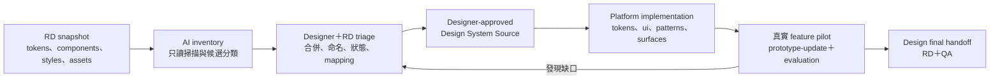

# Phase 1 — Designer／RD Design System Foundation 指南

> **文件狀態：Draft for Designer／RD review**  
> **適用專案：YCO Collab Space**  
> **參考 RD snapshot：`youcam-enhance-frontend` 1.34.1**  
> **決策狀態：本文件目前是 PM 提案；Designer 與 RD review、修正並同意後，才成為強制規範。**

> **已實作的正式契約優先：** 素材已採用全域 `design-library/**`、feature 自然語言指定
> collection、工具自動 index 與 `generation.json` 鎖定實際檔案。Designer 不需要編寫
> manifest。角色與路徑以 `collab-space.map.yaml` 及自動產生的
> `docs/generated/collab-space-reference.md` 為準。

## 1. 這份文件解決什麼問題

YCO Collab Space 已能由 PM source-of-truth 生成臨時 React prototype，但目前的
`platform/ui` 與 Surface Packs 仍是 Phase 0.5 infrastructure fixture，不是
Designer-approved final design system。

Phase 1 的第一件事不是把 RD repo 的所有元件複製進來，也不是立刻要求 Designer 為每個
feature 補 Figma。Designer 與 RD 要先共同把 RD 現有實作整理成一套可被人與 AI 理解的
Design System Foundation：

- 哪些 token 是正式設計來源；
- 哪些元件是可重用的 canonical component；
- 哪些只是 feature-specific、business 或 infrastructure code；
- 重複元件應合併、保留還是淘汰；
- Figma component／variable 如何對應 RD code；
- 哪些 patterns 與 surfaces 可以安全重用；
- 未來變更如何 version、review 與交付。

這份文件定義 Phase 1 的工作順序、角色、交付物、建議資料夾與驗收條件。

## 2. 一張圖看懂 Phase 1



核心原則：

```text
RD code 是盤點來源
        ≠
Designer-approved Design System Source
        ≠
Platform React implementation
```

三者必須可互相追溯，但不能混成同一層。

## 3. 目前已知的 RD 基線

目前 inspection 以本機 snapshot
`/Users/jasonchen/Downloads/yce-frontend-gm-260909` 為依據：

| 項目 | 盤點結果 | 對 Phase 1 的意義 |
|---|---:|---|
| RD package | `youcam-enhance-frontend` 1.34.1 | 所有 mapping 必須記錄來源版本 |
| Baseline tokens | 249 unique names | 已 hash-lock，但尚未全部經 Designer 語意確認 |
| Runtime token extensions | 3 unique names | 明確需要 Designer／RD alignment |
| Combined tokens | 252 unique names | 目前 prototype 的合法 token allowlist |
| `components/common/` 頂層群組 | 52 | 是候選共用元件，不等於 52 個 canonical components |
| Component JavaScript files | 約 2,226 | 包含 feature、business、debug、hooks 與重複實作 |
| Component SCSS Modules | 約 923 | 顯示樣式分散，不能直接當作單一設計系統 |

這些數字是 snapshot inspection evidence，不是 Designer 的最終元件數量。Phase 1 不要求
Designer 手動閱讀 2,226 個檔案；AI／工具應先產生 inventory 草稿，再由 Designer 與 RD
做判斷。

### 3.1 目前需要特別確認的 custom tokens

RD 的 `variables-custom.css` 明確標示下列值不是 Designer export：

```text
--font-size-heading-0
--line-height-heading-0
--video-result-gutter
```

Designer 與 RD 必須決定它們應該：

- 納入正式 token set；
- 改名或改成既有 token alias；
- 保留為 runtime-only extension；或
- deprecated 並指定 replacement。

在決策完成前，不可把它們默認為 Designer-approved token。

## 4. 角色與決策權

| 項目 | Designer | RD | PM／Collab Space Owner | AI／工具 |
|---|---|---|---|---|
| Token 視覺語意與 Figma mapping | 主責 | 評估 code 相容性 | 排定優先級、解決跨角色 blocker | 產生 inventory／parity report |
| Component 命名、anatomy、variants、states | 主責 | 提供現有實作與依賴證據 | 確認 platform 範圍 | 產生候選 catalog |
| Component 是否可安全重用 | 共同決策 | 主責技術判斷 | 處理範圍衝突 | 掃描 imports、network、business dependencies |
| Product flow／acceptance | 不直接更改 | 不直接更改 | PM 主責 | 依 PM source 生成 |
| React／SCSS platform implementation | Review 視覺結果 | Review RD 相容性 | 主責合併與治理 | 實作與驗證 |
| Surface Pack composition | 主責設計規則 | Review 技術可行性 | 確認產品使用範圍 | 建立 schema／resolver／evaluation |
| Design-final promotion | 確認設計 final | 確認 handoff 可用 | PM 核准 promotion | 執行 gate 與產生 evidence |

Designer 不需要負責 production code，也不需要替 PM 定義產品行為。RD 不需要把 production
runtime 搬入 prototype repo。

## 5. Phase 1 工作階段

| 階段 | 主要產出 | 主要參與者 | Platform 是否可開始實作 |
|---|---|---|---|
| P1A — Inventory | Token／component／asset 自動盤點 | AI、RD | 只能做 tooling，不做 final UI |
| P1B — Foundation decisions | Token、typography、spacing、responsive 決策 | Designer、RD | 可實作已 approved 的 foundation |
| P1C — Component rationalisation | Canonical list、duplicates、deprecation、contracts | Designer、RD | 可逐批實作 approved components |
| P1D — Patterns／assets | Pattern、icon、illustration、export rules | Designer、RD | 可實作 approved patterns／assets |
| P1E — Surface approval | Surface zones、slots、layout、responsive、rubric | Designer、PM、RD | 可將 provisional packs 升為 approved |
| P1F — Pilot validation | 真實 feature、visual review、RD handoff | 全部角色 | 通過後擴充下一批，不需一次搬完 |

## 6. P1A — RD Inventory

### 6.1 AI／工具先產生的草稿

工具應從 RD snapshot 只讀產生：

- token definitions、aliases、modes、media-query overrides；
- component path、export name、imports、styles、assets；
- component 使用次數與引用來源；
- backend、Redux、auth、CMS、analytics、payment 等 production dependencies；
- 相似命名、重複 anatomy 與候選 duplicates；
- icon／asset 路徑與使用位置；
- page／feature 與共用元件的關聯；
- 無法靜態判定、需要 Designer／RD 回答的問題。

### 6.2 Designer／RD triage 分類

每個候選元件至少分到一類：

| 分類 | 定義 | 是否進入 platform |
|---|---|---|
| `foundation` | Button、selection、feedback 等基礎元件 | 是，優先 |
| `composite` | Upload panel、download modal、image preview 等複合元件 | 視重用價值 |
| `pattern` | Upload → process → result 等跨元件流程 | 進入 patterns／surfaces |
| `feature-only` | 只服務單一產品功能 | 留在 feature，不進共用 platform |
| `business` | Pricing、subscription、account、payment | 原則上不進 mock-only prototype platform |
| `infrastructure` | Auth、CMS、Redux、analytics、network orchestration | 不進 platform UI |
| `debug` | Debug panel／internal diagnostics | 不進 platform UI |
| `deprecated` | 已有 replacement 或不應再使用 | 只保留 migration mapping |
| `unknown` | 尚無足夠證據 | 保持 open，不默認搬入 |

### 6.3 Inventory 最小欄位

| 欄位 | 說明 |
|---|---|
| `candidateId` | 穩定的盤點 ID |
| `sourceVersion` | RD package／commit／snapshot version |
| `sourcePaths` | React、SCSS、asset 來源路徑 |
| `currentNames` | RD 中所有現有名稱 |
| `usageCount` | 靜態掃描到的引用數量 |
| `dependencies` | Production 或第三方依賴 |
| `candidateCategory` | AI 建議分類，必須標示為 draft |
| `designerDecision` | Designer 的 canonical／merge／feature-only／deprecated 決策 |
| `rdDecision` | 可重用性、technical constraints、replacement |
| `decisionBasis` | 為什麼保留、合併、淘汰或延後 |
| `status` | `draft`／`needs-review`／`approved`／`deprecated` |

## 7. P1B — Token 與 Foundations

### 7.1 Token audit

每個 token 至少要確認：

| 欄位 | Designer／RD 要回答的問題 |
|---|---|
| Category | Primitive、semantic、component 還是 runtime token？ |
| Meaning | 這個名稱表達的是顏色值，還是使用意圖？ |
| Alias | 是否應 reference 另一個 token？ |
| Figma mapping | 對應哪個 collection、variable、mode？ |
| Theme／mode | Light、dark、brand、responsive 或其他 mode？ |
| Status | Approved、temporary、deprecated、missing？ |
| Usage | 哪些 component／slot 可使用？ |
| Replacement | Deprecated 後應改用什麼？ |
| Owner | 未決問題由 Designer、RD 或 PM 解決？ |
| Decision basis | 為什麼採用此命名、值或 mapping？ |

### 7.2 Foundations 清單

Designer至少整理：

- color primitives 與 semantic color roles；
- typography family、size、weight、line-height；
- spacing scale；
- border radius；
- stroke／border；
- elevation／shadow；
- opacity；
- grid、content width 與 alignment；
- breakpoints；
- desktop／tablet／mobile responsive rules；
- focus、disabled、loading 與 accessibility requirements；
- text wrapping、truncation 與 localisation constraints。

### 7.3 格式決策

Designer 與 RD 要共同決定：

- Figma Variables 是否是 authoring source；
- repo source 使用 CSS、JSON 或 DTCG-compatible JSON；
- 如何證明轉換後 CSS 與 RD runtime 完全等價；
- Designer extension 與 RD baseline 衝突時的優先權；
- 誰可以 approve token rename／value change；
- version 與 breaking-change 規則。

在 parity test 與共同協議完成前，不應把 RD CSS 自動轉成新的 JSON source-of-truth。

## 8. P1C — Canonical Component Catalog

### 8.1 第一批優先元件

不做 big-bang migration。第一個真實 prototype 建議先處理約 10–15 個高頻 component
families：

1. Button／icon button／button group
2. Tabs／segmented control
3. Dropdown／selection control
4. Switch／checkbox／radio（以實際 RD inventory 為準）
5. Slider
6. Single／multiple／start-end upload
7. Modal／dialog／confirm dialog
8. Toast／tooltip
9. Loading／skeleton／progress
10. Empty／error／retry state
11. Image／video preview
12. Before／after comparison
13. Result／download actions
14. Header／footer／page chrome
15. Mobile primary action／responsive navigation

這份清單是優先順序草案，不是預先宣告 RD 一定存在相同 canonical component。

### 8.2 每個 component contract 必須回答

| 項目 | 內容 |
|---|---|
| Stable ID | 不跟著 Figma layer 名稱任意改變 |
| Display name | PM、Designer、RD 使用的共同名稱 |
| Figma reference | Component set／node／version |
| RD mapping | 現有 code path、export、版本 |
| Anatomy | Root、label、icon、media、actions 等 slots |
| Variants | Primary、secondary、ghost 等 |
| Sizes | 支援的 size 與使用情境 |
| States | Default、hover、focus、pressed、disabled、loading、error |
| Props／content | 文案長度、icon 位置、optional slots、禁止組合 |
| Token map | 每個 slot 使用哪些 approved tokens |
| Responsive | 不同 viewport 的尺寸、排序、collapse／scroll 行為 |
| Accessibility | Keyboard、focus、ARIA、contrast、motion |
| Usage rules | 何時使用／不使用，並附 examples |
| Dependencies | Platform-safe dependencies 與禁止的 production dependencies |
| Status | Draft、approved、experimental、deprecated |
| Replacement | Deprecated component 的替代方案 |
| Decision basis | 為什麼如此定義或與 RD 實作不同 |

### 8.3 Duplicate resolution

遇到多個 modal、upload、tabs 或 preview implementations 時，不可以只選最新檔名。
Designer 與 RD 必須記錄：

- 是同一 component 的 variants，還是不同 mental model；
- 哪一個 anatomy／interaction 應成為 canonical；
- 哪些差異來自 production business logic，不應進 platform；
- 舊 implementation 的 replacement；
- 無法立即 migration 時的 temporary status。

## 9. P1D — Assets、Patterns 與 Content Rules

### 9.1 全域 Design Library

所有 Designer web-ready 素材，不論目前只給一個 feature 用或已知可共用，都集中在：

```text
design-library/assets/<type>/<collection>/
```

固定 type 為 `image`、`video`、`icon`、`illustration`、`logo`；collection 名稱由
Designer用容易理解的 kebab-case 命名，例如 `assets/video/dance`。不複製到每個 feature，
也不要求 Designer 撰寫 YAML／manifest。

PM 尚在做第一版 prototype 時的暫時素材放在
`features/<feature>/product/mock-assets/**`。它可供 PM review，但 `design-final` gate
一定阻擋。Evidence 與 build output 仍分別放在 `evidence/**`、`dist/**`，都不是 Designer source。

### 9.2 Asset catalog 與 Designer／RD 整理項目

Designer 與 RD 要整理：

- asset stable ID、名稱、類型、用途與 owner；
- Figma file／node／version 與 repo file mapping；
- final、temporary、experimental、deprecated 狀態；
- desktop／tablet／mobile、light／dark variants；
- 圖片尺寸、aspect ratio、crop／focal-point 規則；
- image alt text 或 decorative status；
- icon filled／outlined／active／disabled variants；
- SVG viewBox、尺寸、stroke、fill 與是否可透過 `currentColor` 換色；
- logo variants 與禁止變形規則；
- empty、error、upload、placeholder illustrations；
- video poster、autoplay、muted、loop、controls、captions 與 reduced-motion；
- export format、quality、compression 與待決定的檔案大小 budget；
- copyright／licence／production-only restrictions；
- deprecated assets 與 replacement；
- 每項選擇的 decision basis。

### 9.3 建議格式

| 類型 | 建議格式 | 規則 |
|---|---|---|
| 一般照片 | WebP | Prototype 預設；保留必要畫質並控制檔案大小 |
| 透明圖片 | WebP 或 PNG | 依透明度與畫質需求選擇 |
| Logo／vector illustration | SVG | 必須通過安全檢查，不可含 script 或 external reference |
| Icon | SVG | 必須宣告 static 或 `currentColor` color behavior |
| Pixel-perfect reference | PNG | 只在確實需要時使用，避免大量高解析 PNG |
| 一般影片 | MP4 H.264 | 預設相容格式；WebM 可作 optional variant |
| Video poster | WebP | 每支影片原則上必須提供 |
| 有口白影片 | MP4＋字幕／transcript 決策 | 需要 accessibility review |

不要把 Base64 塞進 React code，也不要使用不穩定的第三方 CDN、Google Drive、Figma preview
URL、`file://` 或 production-only asset endpoint。

### 9.4 不使用 Designer manifest

Designer只需上傳素材。PM／Designer在功能需求中用自然語言說「請 index
`assets/video/dance`」，Agent才掃描該 collection。若 Designer沒有另外說明，所有新檔案
自動視為 `candidate`；Agent依功能需求選出實際使用檔案，`generation.json` 記錄檔案路徑與
hash。進入 `design-final` 前，Designer一次確認本版實際 selection，不需逐檔登記。

### 9.5 Prototype ingestion 規則

`prototype-update` 依 feature 的 `product/media-intent.yaml` 查詢指定 collection，並以靜態
imports 讓 Vite只打包本功能實際使用的素材：

```jsx
import tutorialVideo from '../../../design-library/assets/video/dance/tutorial.mp4';
```

不應在 mock JSON 直接寫相對檔案路徑，因為 Vite 不會可靠地轉換 JSON 中的字串。Mock data
只保存 asset ID，generated code 建立 registry：

```json
{
  "imageAssetId": "relight-result-01"
}
```

```jsx
import relightResult01 from '../design/assets/images/result-01.webp';

const assetRegistry = {
  'relight-result-01': relightResult01,
};
```

只有被 `media-intent.yaml` 指定的 collection 會進入 context。Working revision跟隨 global
Design Library變化並標示 stale；凍結 revision則鎖定 selection、collection hash、檔案 hash
與 token lock。`.collab-cache/**` 是本機自動索引，不 commit、不公開。

### 9.6 Icon ingestion

- 不需換色的 static SVG 可由 Vite URL import，使用 `` 呈現。
- 需要 hover／disabled／selected token color 的 icon，不可由 AI 任意修改 fill／stroke。
- Phase 1 應建立安全的 SVG → Platform Icon pipeline，驗證 SVG 後轉成使用 `currentColor` 的
  canonical icon component。
- Pipeline 尚未完成前，Designer 要提供明確 variant 或將缺口記錄為 blocking gap。

### 9.7 Video ingestion

Designer 必須為每支影片定義：

- poster image；
- aspect ratio 與 responsive behavior；
- autoplay／muted／loop／controls／playsInline；
- loading、error 與 static fallback；
- 是否有聲音、口白、字幕或 transcript；
- reduced-motion 行為；
- desktop／mobile 是否使用不同 export。

一般教學影片預設不 autoplay、顯示 controls、提供 poster；純裝飾性循環影片才考慮
`autoplay + muted + loop + playsInline`，並仍需 static fallback。

### 9.8 Asset validation gates

Phase 1 asset validator 至少要阻擋：

- collection 路徑逃逸、類型不支援或 required collection 不存在；
- generated code 引用未被 provenance 鎖定的素材；
- selected file 遺失或 hash 改變；
- 大小寫錯誤或不支援格式；
- 非 decorative image 缺少 alt；
- decorative image 未正確隱藏；
- SVG 包含 script、external reference 或不允許的 raw color behavior；
- 影片缺少 poster、fallback 或必要 accessibility decision；
- asset 超過團隊核准的 size budget；
- runtime 使用遠端 URL、Figma URL、`file://` 或 production endpoint；
- design-final仍引用 PM mock asset；
- public build夾帶本機 index、source manifest或未選素材。

### 9.9 Patterns

Pattern 是多個 components 共同完成的可重用互動，不等於單一 component。優先盤點：

- upload → processing → result；
- before／after comparison；
- tool settings panel；
- generation form；
- history／result gallery；
- empty／error／retry；
- download flow；
- confirm／destructive action；
- desktop sidebar／mobile bottom action；
- loading／progress／cancel。

每個 pattern 要定義 states、component composition、content hierarchy、responsive、適用與
不適用情境，以及 Figma／RD references。

## 10. P1E — Surface Packs

目前四個 implemented Surface Packs 是 provisional：

```text
marketing/product-page
workspace/tool-image-generator
workspace/tool-photo-editing
workspace/tool-video
```

Designer-approved Surface Pack 至少要有：

| 項目 | 說明 |
|---|---|
| Mental model | 這種頁面幫使用者完成什麼工作 |
| Required zones | 一定出現的 layout zones |
| Component slots | 每個 zone 可放哪些 canonical components／patterns |
| Hierarchy | Primary action、content、supporting information 的優先順序 |
| States | Empty、input、processing、result、error、recovery |
| Responsive | Desktop／tablet／mobile 的 layout transformation |
| Allowed deviations | Feature 可以調整什麼、不可以改什麼 |
| References | Approved Figma／screenshots／RD examples |
| Evaluation rubric | 如何判斷生成結果符合 Surface，而不只檢查 DOM 名稱 |
| Version | Breaking／non-breaking change 與 changelog |
| Decision basis | 為什麼此組合可重用 |

Surface Pack 必須建立在 approved component IDs 上。Component Catalog 尚未穩定前，不應把
provisional Surface Pack 宣稱為 final。

Novel feature 仍可進入 PM review；它不需要等待 Surface Catalog 完整。但若要升級成可重用
Surface，必須回到本流程接受 Designer／RD review。

## 11. 建議的 repo 結構

目前採用的分層如下；component/token authoring細節仍可由 Designer、RD 與 PM後續調整：

```text
design-library/                         # Designer-owned shared source
├── assets/<type>/<collection>/         # upload only; no manifest required
├── tokens/                             # future Figma token exports
├── components/                         # future Designer/RD contracts
└── patterns/                           # future reusable design patterns
platform/                               # runnable implementation; Designer不手改
├── tokens/
│   ├── rd/<version>/                    # RD immutable snapshot
│   └── tokens.lock.json
├── ui/                                  # AI／Platform Owner React implementation
├── surfaces/                            # Approved composition implemented as packs
└── runtime/                             # Prototype runtime；Designer 不負責
```

### 11.1 Source boundary

| 路徑 | 性質 | 誰決策／修改 |
|---|---|---|
| `platform/tokens/rd/**` | Immutable upstream evidence | RD 提供；工具 lock；不手改 |
| `design-library/**` | Designer-owned shared source | Designer上傳；Designer＋RD決策；PM管理流程 |
| `platform/ui/**` | Derived implementation | AI／Platform Owner 實作；Designer review |
| `platform/surfaces/**` | Derived／versioned implementation | Platform Owner 實作；Designer＋PM approve |
| `platform/runtime/**` | Prototype infrastructure | Platform Owner |
| `features/*/design/**` | 單一 feature Figma reference／gaps；長期 schema待定 | Designer／Agent依確認更新 |
| `features/*/product/mock-assets/**` | PM暫時素材 | PM；design-final禁止 |
| `features/*/generated/**` | AI-generated prototype | AI；禁止手改 |

## 12. 單一 feature 的 Designer 工作

平台 foundation 建立後，每個 feature 的 Designer 工作才是：

1. 讀取 PM 的 PRD、contract、states、acceptance 與 surface intent。
2. 在 Figma 使用 approved tokens、components、patterns 與 Surface Pack。
3. 更新 `features/<feature>/design/design.ref.json`。
4. 更新 `features/<feature>/design/design-gaps.yaml`。
5. 將 web-ready images／icons／videos放入全域 `design-library/assets/<type>/<collection>/`。
6. 告訴 Agent 本功能要 index 哪個 collection；不需寫 manifest。
7. 若 final design 改變 product flow／state／validation，退回 PM 更新 product source。
8. Designer 或 PM 觸發 `/prototype-update <feature>`。
9. Review rendered prototype、responsive screenshots、selection 與 visual evidence。
10. 所有 blocking gaps 解決後，一次確認實際 selection與 design final。

Designer 不直接修改 `generated/**`；Designer 可以觸發 update，因為安全邊界是可修改的
source paths，不是執行指令的人。

## 13. Platform implementation 的開始條件

某一批 foundation／components 同時滿足下列條件，該批才可進入 `/platform` 實作：

- RD source version 與路徑已記錄；
- Designer classification 已確認；
- RD 已確認可重用性與 production dependencies；
- canonical ID、anatomy、variants、states 已明確；
- Figma mapping 已存在；
- token mapping 只引用 approved tokens；
- responsive 與 accessibility rules 已定義；
- asset IDs、formats、Figma mappings、licences 與 export rules 已定義；
- video behavior、poster、fallback 與 accessibility decision 已完成；
- duplicate／deprecated decisions 已記錄；
- unresolved questions 有 owner 與狀態；
- decision basis 已留下；
- Designer、RD 與 PM／Owner 同意該批進入 implementation。

不需要等所有 RD components 完成才開始。採用逐批 approval，可避免 Phase 1 被大型 inventory
拖住。

## 14. Phase 1 Definition of Done

Phase 1 Design System Foundation 完成，至少要證明：

- AI 可從鎖定的 RD snapshot 重建 inventory；
- Designer 與 RD 已 approve 第一批 canonical components；
- 249 baseline tokens 與 3 extensions 都有 mapping 或明確 pending decision；
- 沒有 platform component 使用 raw colour 或 unknown token；
- 第一批 component contracts 通過 schema validation；
- collection index、selection provenance 與 validation gates 通過；
- 所有 prototype runtime assets 都能追溯到 Design Library 或 PM temporary source；
- 沒有 runtime Figma／Drive／`file://`／production asset URL；
- SVG safety、alt／decorative、video poster／fallback 與 size budget checks 通過；
- Figma references、RD mappings 與 platform implementations 可追溯；
- 至少一個真實 feature 使用 approved foundation 完成 design review；
- desktop／tablet／mobile rendered checks 通過；
- visual parity 由 Designer 人工確認，並留下 evidence；
- RD 可從 handoff 找到 component、token、state 與 mock-data context；
- blocking design gaps 歸零後才可進入 `DESIGN_FINAL_READY`；
- YCO-spec 與 promote gate 依 Phase 1 整體計畫完成後，才正式交 RD／QA。

## 15. Review meeting 建議議程

第一次 Designer／RD meeting 建議只決定下列事項：

1. 誰代表 Designer 與 RD approve foundation decisions？
2. Figma file、Variables、component naming 現況是什麼？
3. `variables.css` 是否真的是 Designer export？更新頻率與 owner 是誰？
4. 三個 custom tokens 如何處理？
5. 第一個真實 prototype 需要哪些 10–15 個 component families？
6. 哪些 RD component paths 最接近這些 families？
7. Component status vocabulary 與 versioning 如何定義？
8. Figma／RD mapping 要用 URL、file key、node ID 還是其他格式？
9. Asset export 格式、size budget、licence 與存放方式？
10. Icon 是否需要 SVG-to-React／`currentColor` pipeline？
11. Video poster、captions、autoplay 與 reduced-motion 的預設規則？
12. 誰 review AI 產生的 inventory 與 platform implementation？

不建議第一次 meeting 就審核全部 2,226 個 JavaScript files。

## 16. 尚待 Designer／RD 決定

| 問題 | 暫時處理 | Block 什麼 |
|---|---|---|
| Figma handoff schema | `design.ref.json` 只保留簡單 reference | 自動 Figma ingestion |
| Token authoring format | RD CSS snapshot 保持權威、唯讀 | Designer token extension workflow |
| DTCG JSON | 不轉換 | Token build pipeline |
| Component naming／status vocabulary | 使用本文件提案做 workshop 起點 | Canonical catalog schema |
| Designer extension 與 RD baseline 衝突 | 記錄 gap，Designer＋RD 討論 | Design final |
| Asset metadata schema | Designer不需逐檔填寫；需要時由工具推導或日後共同決定 | Alt、licence、video accessibility自動化 |
| Asset repository／export format／size budget | 不自動搬 RD assets | Approved asset library |
| Icon color pipeline | Static SVG 只能以 URL import；不可由 AI 任意改 fill／stroke | Token-driven canonical icons |
| Video accessibility defaults | 每個 feature 記錄 poster／controls／captions gap | Approved video component／design final |
| Surface Pack approval process | 現有 packs 保持 provisional | Designer-approved reusable surfaces |
| CODEOWNERS／protected paths | Phase 1 team discussion 後實施 | 強制 ownership governance |

## 17. 不要做的事

- 不要把 RD 的 2,226 個 JavaScript files 視為 2,226 個 design components。
- 不要把整個 RD component tree 複製到 `platform/ui`。
- 不要讓 Designer 人工從零盤點所有 import paths；先由 AI 產生 inventory。
- 不要直接修改 `platform/tokens/rd/**` 或 `tokens.lock.json`。
- 不要在 feature SCSS 自創 raw colour 或新 token 名稱。
- 不要在 component catalog 未確認前，把 provisional Surface Pack 宣稱為 final。
- 不要因為 Figma 與 RD code 不一致，就由 AI 靜默選一邊；必須留下 gap 與 owner。
- 不要讓 visual design 變更偷偷改變 PM-owned product behavior。
- 不要把 production auth、API、CMS、Redux、analytics 或 payment dependencies 搬入 prototype。
- 不要以 Figma preview、Drive、`file://` 或 production CDN URL 當 runtime asset。
- 不要把 Base64、PSD、AI、AE project 或未壓縮大型影片塞進 generated code。
- 不要要求 Designer替每個 asset寫 manifest；feature以 collection intent決定候選範圍。
- 不要讓 AI 未經核准改寫 SVG fill／stroke 或自動壓縮 final asset。
- 不要要求 Designer 完成全部 inventory 才允許第一批 platform component 開始。

## 18. 決策判斷依據

| 決策 | 判斷依據 |
|---|---|
| Inventory 先於 platform migration | RD repo 同時包含共用、feature、business、debug 與 production infrastructure，直接搬入會把錯誤邊界固化 |
| AI 先產生 inventory 草稿 | 2,226 JS／923 SCSS 的規模不適合由 Designer 人工逐檔閱讀；機械盤點應交給工具，人負責語意決策 |
| Designer 與 RD 共同 approve | Designer 擁有視覺語意，RD 擁有實作依賴與可重用性證據；單一角色無法完整判斷 |
| RD token snapshot 保持 immutable | 已有 hash 與 runtime evidence；直接重寫會失去與 production code 的可追溯性 |
| 不立即轉 DTCG | CSS 內含 aliases、media-query overrides 與 runtime extensions；沒有 parity test 的轉換可能改變行為 |
| Component contract 與 React implementation 分層 | 規格需要穩定、可由 Designer review；React code 是可更新的實作，不應成為唯一設計來源 |
| 逐批建立 canonical components | 第一個真實 feature 只需要有限 component families；big-bang migration 會延後可驗證成果 |
| Surface 建立在 component catalog 之上 | Surface slots 若引用不穩定元件名稱，後續每次 catalog 調整都會破壞生成與 evaluation |
| Novel feature 不等待 catalog 完整 | 新產品可能沒有既有 mental model；Surface Pack 是加速器，不是准入白名單 |
| Designer 可 trigger update 但不手改 generated code | Source ownership 由路徑與 mutation guard 保護，不需要以「誰按指令」限制協作效率 |
| 所有 unresolved items 都要有 owner | 沒有 owner 的 gap 會被 AI 當成可自由猜測，造成 prototype、Figma 與 RD implementation 漂移 |
| 所有 Designer assets集中全域 library | 多數資產能跨 feature重用；即使目前 feature-specific，也避免複製與日後搬移 |
| Designer不寫 manifest | 操作者以 PM／Designer為主；由 feature自然語言指定 collection、工具鎖定 selection與 hash較不易漏登記 |
| Vite 靜態 import，不用 JSON path／remote URL | 靜態 import 可在 build 時抓到 missing file、產生 hash 並部署完整資產；字串路徑與遠端 URL 無法提供相同保證 |
| Editable master 與 web-ready export 分開 | Figma／PSD／AE 是設計 authoring source，但 prototype 需要可版本化、可打包、可重建的瀏覽器格式 |
| Icon／video 需要專門 gates | SVG 可能含危險或不可換色內容；影片涉及 poster、autoplay、captions、fallback、效能與 reduced-motion，不能只當一般檔案 |
