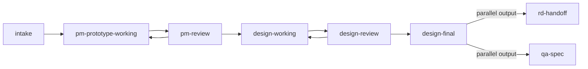

<!-- GENERATED by npm run docs:generate. Edit collab-space.map.yaml, not this file. -->
# Collab Space 正式契約速查

本頁由 `collab-space.map.yaml` 自動產生。它是角色、階段、資料位置與外部系統邊界的速查表；若本頁與契約不同，`npm run docs:check` 會失敗。

## 階段與核准

| 階段 | 類型 | 可參與角色 | 必要產物 | 離開階段需要 |
|---|---|---|---|---|
| `intake` | lifecycle | Product manager、AI agent | `pm-product-source` | Product manager |
| `pm-prototype-working` | lifecycle | Product manager、AI agent | `pm-product-source`、`generated-prototype` | Product manager |
| `pm-review` | lifecycle | Product manager、Manager reviewer、AI agent | `frozen-revision` | Product manager |
| `design-working` | lifecycle | Designer、Product manager、AI agent | `design-library`、`generated-prototype` | Designer |
| `design-review` | lifecycle | Designer、Manager reviewer、Product manager、AI agent | `frozen-revision` | Designer、Product manager |
| `design-final` | lifecycle | Designer、Product manager、AI agent | `frozen-revision`、`approved-design-selection` | Designer、Product manager |
| `rd-handoff` | downstream | Product manager、Research and development、AI agent | `frozen-revision` | Product manager |
| `qa-spec` | downstream | Product manager、Quality assurance、AI agent | `frozen-revision`、`qa-human-spec` | Product manager |

`rd-handoff` 與 `qa-spec` 是從同一個 `design-final` 版本產生的平行輸出，不會互相等待或改變目前 lifecycle stage。

## 資料位置與 Owner

| Artifact | Owner | 位置 | 性質 | 狀態 |
|---|---|---|---|---|
| `pm-product-source` | Product manager | `features/{feature}/product/**` | source | active |
| `design-library` | Designer | `design-library/**` | source | active |
| `feature-design-record` | Designer | `features/{feature}/design/**` | source | proposed |
| `generated-prototype` | AI agent | `features/{feature}/generated/**` | derived | active |
| `validation-evidence` | AI agent | `features/{feature}/evidence/**` | derived | active |
| `frozen-revision` | Product manager | `features/{feature}/releases.json` | record | active |
| `approved-design-selection` | Designer | `features/{feature}/generated/generation.json` | record | proposed |
| `qa-human-spec` | Quality assurance | `features/{feature}/specs/**` | derived | proposed |

## Workflow 寫入邊界

### `prototype-intake`

- Actors: Product manager、AI agent
- 可寫入：`features/{feature}/product/**`、`features/{feature}/design/design-gaps.yaml`、`features/{feature}/releases.json`
- 保護區：`platform`、`design-library`
- Enforcement: `error`

### `prototype-update`

- Actors: AI agent
- 可寫入：`features/{feature}/generated/**`、`features/{feature}/evidence/**`、`.prototype-state/**`、`.collab-cache/**`
- 保護區：`collab-space.map.yaml`、`features/{feature}/product`、`features/{feature}/design`、`design-library`、`platform`
- Enforcement: `error`

### `design-library-upload`

- Actors: Designer
- 可寫入：`design-library/assets/**`、`design-library/tokens/**`、`design-library/components/**`、`design-library/patterns/**`
- 保護區：`features`、`platform`
- Enforcement: `warning`

## 外部系統邊界

| 系統 | Owner | 方向 | 可見性 | 可否有 production data |
|---|---|---|---|---|
| `figma` | Designer | input | private | 不可 |
| `private-github` | Product manager | both | private | 不可 |
| `local-workspace` | Product manager | both | private | 不可 |
| `public-preview` | Product manager | output | public-selected-assets-only | 不可 |
| `rd-repository` | Research and development | output | private | 可（僅該外部正式系統） |
| `yco-spec` | Quality assurance | output | private | 不可 |

## 判斷依據

- The contract is the control plane for roles, stages, paths and external-system boundaries.
- Shared design resources live once in the global Design Library; feature revisions pin exact selections.
- Agent and validator rules are enforced now, while human Git enforcement remains proposed.
