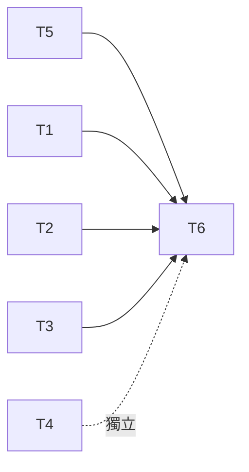

# Handoff：產品頁 track 待辦

日期：2026-09-02 ｜ 執行：Opus ｜ 審核：Fable ｜ 分支：`feat/product-page-track`

## 背景

產品頁 track 已實作並在 fixture `ai-motion-transfer` 上跑通（`npm run build`、48 個測試全綠）。
架構說明：`docs/architecture/2026-09-02-product-page-track-discussion.md`；
細節設計：`docs/architecture/2026-09-02-product-page-generator-plan.md`。
接下來的分工：

- 各角色確認架構，把決定寫進自己的資料夾。
- 每一批工作先轉成這種 handoff 文件（模板 `docs/handoff/_template.md`），Opus 依文件執行。
- Fable 只審核專案結構與找優化項目，不寫實作。

## 執行規則（每個 task 都適用）

1. 動手前先讀 `AGENTS.md`、`COLLABORATION.md`、上面兩份架構文件，以及 task 列出的輸入檔。
2. 只改 task 的「只改」路徑。既有檔案只追加，不刪、不改既有行為；新能力放角色資料夾並登記在 `collab-space.map.yaml`。
3. 改 `strapi/**`、`design-library/patterns/**`、`product-library/**` 或 skill 後，fixture 的 `generation.json` 會 stale，要重跑 `/product-page-generate ai-motion-transfer`（含獨立 reviewer）再 `npm run page:validate`。
4. 每個 task 結束跑「驗收」指令，全綠才回報 DONE。最後一定跑 `npm run build && npm test`。
5. 不 commit `refs/`、`.env`、任何 token 或密碼。不打真實 Strapi，除非 task 明說且 PM 當場確認；只建 draft，`publishedAt` 永遠禁止。
6. 需要角色決定的事：停下，寫進 task 的「待決定」，不猜、不代答。
7. 不 commit 到 main。在 `feat/product-page-track` 上 commit，訊息以 `page-track:` 開頭。

## Tasks

### T1：套用 RD 確認後的 Strapi registry
- 需要誰先給輸入：RD（討論文件第 8 節 1 到 4 項）
- 輸入：RD 提供的 component uid 清單、enum 值、更新 entry 時巢狀 id 的處理方式、`/upload` 的驗證方式
- 只改：`strapi/components/*.json`、`strapi/registry.yaml`、`strapi/mapping/rules.md`、`tools/product-page/push-strapi.mjs`、`tools/product-page/policy.test.mjs`
- 步驟：
  1. 每個 `uidStatus: inferred` 依 RD 回覆改成 `confirmed`；uid 不同就改 uid，並用 `npm run page:validate` 找出失效的 pattern 與 payload。
  2. 把 `backgroundColor`、`layout`、`buttonType` 的 enum 寫進對應 component 的 `values`；型別由 `string` 改 `enumeration`。
  3. 依 RD 決定實作更新 entry 時巢狀 id 的保留或移除；`rules.md` 第 7 節「待 RD 確認」逐項移到正文。
  4. 若 `/upload` 只接受 API token，`push-strapi.mjs` 的上傳改讀 `STRAPI_ADMIN_TOKEN`，`strapi/client/README.md` 與 `.env.example` 同步。
  5. `policy.test.mjs` 加一個 mutation：payload 使用 enum 外的 `buttonType` 必須被抓到。
- 驗收：
  ```bash
  npm run page:validate:registry
  npm run page:validate -- --page ai-motion-transfer
  node --test tools/product-page/policy.test.mjs
  ```
- 不得：改 `platform/**`；把 RD 給的憑證寫進任何檔案
- 待決定：

### T2：套用 Design 確認後的 pattern 與素材
- 需要誰先給輸入：Design（討論文件第 7 節）
- 輸入：Design 對 7 個 pattern 的 token、素材規格、文案上限的回覆；上傳到 `design-library/assets/video/ai-motion-transfer` 的檔案
- 只改：`design-library/patterns/product-page/*.yaml`、`design-library/skills/page-layout/SKILL.md`、`design-library/assets/**`、`product-pages/ai-motion-transfer/source/page.source.yaml`
- 步驟：
  1. 依回覆更新每個 pattern 的 `tokens`、`copy`、`media`，`status` 由 `provisional` 改 `confirmed`；token 名稱必須在 `platform/tokens/tokens.lock.json`，不能自創。
  2. 素材進 `design-library/assets/` 後跑 `npm run library:index`，確認能被查到。
  3. `page.source.yaml` 的 `media.allowMockAssets` 改 `false`；重新生成後 payload 內不得再有 `strapi:yco-placeholder-2880x1254` 以外的佔位素材，hero 與 use case 改指向 `design-library:assets/...`。
  4. Design 若新增 pattern，同時要求 RD 在 `strapi/registry.yaml` 有對應 component，否則標為待決定。
- 驗收：
  ```bash
  npm run page:binding
  npm run page:validate -- --page ai-motion-transfer
  npm run page:publish -- --page ai-motion-transfer     # dry run 必須列出所有要上傳的檔案
  ```
- 不得：改 `strapi/**`；為了通過驗證放寬 pattern 的字數或素材規格
- 待決定：

### T3：處理 reviewer 的兩個發現並更新 PM 文件
- 需要誰先給輸入：PM（討論文件第 9 節）
- 輸入：PM 對評分、SEO title、messaging 與 rubric、真實限制的決定
- 只改：`product-library/products/ai-motion-transfer/product.yaml`、`product-library/messaging/*.md`、`product-library/review/spec-compliance-rubric.md`、`features/ai-motion-transfer/product/prd.md`、`product-pages/ai-motion-transfer/source/brief.md`、`product-pages/ai-motion-transfer/generated/**`
- 步驟：
  1. 評分：PM 給新值就更新 `product.yaml.ratings` 並把 `decisionBasis` 的「不可再用」句改成確認日期；PM 說拿掉就在 `brief.md` 加「SEO 不放 ratings」，生成時省略。
  2. SEO title 依 PM 決定；若改用官方名，`brief.md#must-say` 保持不變即可。
  3. messaging 與 rubric：把 PM 修改直接寫入；檔頭 `status` 改 `confirmed`。
  4. 真實限制寫進 `prd.md` 新增的 `## Limits` 段，讓 content 可以引用。
  5. 重跑 `/product-page-generate`，reviewer verdict 必須是 `pass`（沒有 major）。
- 驗收：
  ```bash
  npm run page:validate -- --page ai-motion-transfer
  node -e "const r=require('./product-pages/ai-motion-transfer/generated/review/spec-compliance.json');if(r.findings.some(f=>['blocker','major'].includes(f.severity)))process.exit(1)"
  ```
- 不得：自己編評分或限制數字；手改 `generated/**` 而不重跑生成
- 待決定：

### T4：建立第一個競品資料
- 需要誰先給輸入：PM（指定 1 到 2 個競品與 URL）
- 輸入：競品名稱與產品頁 URL
- 只改：`product-library/competitors/<slug>/**`、`product-library/competitors/README.md`
- 步驟：
  1. `npm run library:product:capture -- --url <url> --to competitors/<slug>/pages/<name>.md` 擷取頁面。
  2. 依 `_template` 填 `competitor.yaml` 與 `analysis.md`；差異分析只寫觀察到的，不推測。
  3. `npm run library:product:index` 更新索引。
  4. 在 `policy.test.mjs` 確認既有 mutation「競品檔不能是能力唯一來源」仍會擋新競品路徑；若沒擋到，修 `content-policy.mjs` 的 `allowedSourceRoots`。
- 驗收：
  ```bash
  npm run library:product:index
  node --test tools/product-page/policy.test.mjs
  ```
- 不得：把競品文案複製進任何 `features/**` 或 `product-pages/**/source/**`
- 待決定：

### T5：產品頁 workflow eval（不需角色輸入）
- 需要誰先給輸入：無
- 輸入：`tools/evaluation/workspace.mjs` 的 `createIsolatedWorkspace`／`cleanupIsolatedWorkspace`／`runCommand`；既有 `npm run eval:workflow` 的做法
- 只改：`tools/evaluation/run-page-eval.mjs`（新檔）、`package.json` scripts（新增 `eval:page`）、`docs/architecture/2026-09-02-product-page-generator-plan.md` 第 6 節指令表
- 步驟：
  1. 在隔離 workspace 複製 repo，跑 `page:update:begin` → `page:validate` → `page:publish`（dry run）→ `page:update:check`，全部成功才 PASS。
  2. 額外植入一個篡改（例如改 `strapi/mapping/rules.md` 一行）確認 `page:update:check` 會 FAIL，然後清理。
  3. eval 只讀 repo，不寫回 repo；輸出摘要到 stdout。
- 驗收：
  ```bash
  npm run eval:page
  git status --short      # 不得有任何 eval 造成的變更
  ```
- 不得：在 eval 內呼叫 LLM 或真實 Strapi
- 待決定：

### T6：第一次真實 Strapi draft（人工在場）
- 需要誰先給輸入：RD 的測試環境 `.env`；PM 當場確認；T1 到 T3 先完成
- 輸入：根目錄 `.env`（不進 repo）
- 只改：`product-pages/ai-motion-transfer/evidence/**`（已 gitignore）、`product-pages/ai-motion-transfer/releases.json`
- 步驟：
  1. `npm run page:publish -- --page ai-motion-transfer` dry run，把要上傳的素材與 payload 摘要給 PM 看。
  2. PM 說可以，才跑 `--confirm`；回傳 entry id 與 admin preview URL。
  3. 打開 preview，逐 section 對照 `layout.json`；有不符就記在待決定，不改 payload 硬湊。
  4. `/product-page-promote ai-motion-transfer page-strapi-draft`，確認 evidence hash 綁定成功。
- 驗收：
  ```bash
  ls product-pages/ai-motion-transfer/evidence/publish/
  npm run page:validate -- --page ai-motion-transfer
  ```
- 不得：publish；用 `--entry` 覆蓋任何不是本流程建立的 entry；把 evidence 或 `.env` commit
- 待決定：

## 順序



T5 現在就能做。T1、T2、T3、T4 各自等一個角色的輸入，彼此獨立。T6 最後。

## 回報格式

每個 task 一行：`T<n> DONE|BLOCKED|SKIPPED — 驗收指令輸出摘要 — 待決定`。
全部結束附 `npm run build && npm test` 的最後幾行，以及 `git log --oneline main..feat/product-page-track`。

## Fable 審核時會看的（給 Opus 參考，不是 task）

- 是否有繞過 validator 的手改 `generated/**`。
- 新增的規則是否同時寫進 skill、`rules.md` 與 validator 三處。
- 第二頁產品頁能否只靠 `npm run page:create` 加 PM brief 就跑通，證明流程沒有綁死在 fixture。
