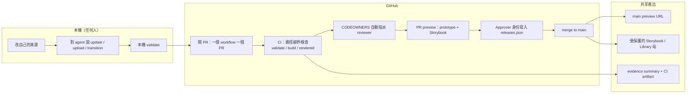

# Collab Space 優化評估：共同編輯、不重工、更新不互相影響、同一環境產出

> 日期：2026-09-02。依據 `main` `be09a65` 與 `feat/product-page-track` `b93c19e`。
> 前置閱讀：[架構與共編模式說明](./2026-09-02-collab-space-overview.md)。
> 性質：評估與建議，尚未實作。每項附證據、風險與建議做法，供 Owner 排序。

---

## 0. 結論先講

架構的「路徑即權限、hash 綁核准、來源與衍生物分離」設計是對的，Agent 層面的防護已經很完整。**目前的缺口都在「人」與「環境」這一側：規則只在本機、只對 Agent 生效，人類走 Git 時沒有任何強制；驗證結果與 Storybook 也只存在執行者的電腦上。** 所以四個目標的達成度是：

| 目標 | 達成度 | 主要缺口 |
|---|---|---|
| 共同編輯 | 中 | 路徑權限只擋 Agent，人類 commit 不擋；沒有分支／PR 規範 |
| 不重工 | 中高 | 素材、元件、Surface 都有單一來源；但文件重複且部分過時，階段紀錄與現實脫節 |
| 更新不互相影響 | 高（Agent）／低（人） | hash 機制完整；但無 CI，別人 push 壞了要等自己本機跑才知道 |
| 同一環境產出 | 低 | 無 CI、無 devcontainer、evidence 與 Storybook 只在本機、文件含個人絕對路徑 |

建議順序：**先把既有規則搬上 CI 與 CODEOWNERS（第 1、2 項），再處理 evidence 與 preview 的共享（第 3、8 項），其餘逐步。** 前兩項幾乎不需要新設計，`collab-space.map.yaml` 已經有生成所需的全部資料。

---

## 1. 把 `collab-space.map.yaml` 的路徑權限變成 CODEOWNERS 與 PR 檢查

**現況證據**
- map 裡 `human-git-path-enforcement` 規則是 `status: proposed`、`enforcement: warning`。
- repo 無 `CODEOWNERS`、無 `.github/`、無 branch protection。
- AGENTS.md 明說「Phase 0 documents these boundaries but does not enforce CODEOWNERS yet」。

**風險**
- Designer 直接改 `product/prd.md`、PM 直接改 `generated/feature.jsx`，Git 不會擋，下一次 update 才發現 stale 或衝突。
- 「安全邊界是路徑不是人」的設計，在人類 commit 這一側完全沒有落地。

**建議**
1. 在 map 的 `actors` 加 `githubTeams`／`githubHandles` 欄位。
2. 新增 `tools/collab-space/generate-codeowners.mjs`，由 map 的 `artifacts[].owner` 與 `artifacts[].path` 產生 `CODEOWNERS`，納入 `docs:generate`／`docs:check`，讓它跟 reference 一樣「手改就 fail」。
3. GitHub Action：PR 觸發時，用 `tools/collab-space/policy.mjs` 的 `workflowPolicy` 比對 PR 變更檔案與 PR 標籤（`workflow: prototype-update` 等），越界就 fail。這不需要新邏輯，`source-boundary.mjs` 已有 diff 能力。
4. 把 map 裡該規則改為 `status: active` 前先讓團隊看一次。

**成本** 小。全部資料已在 map 內。

---

## 2. 建 CI：把本機 gate 搬到 GitHub Actions

**現況證據**
- `npm run validate`、`build`、`test:rendered`、`eval:*` 全部只在本機執行；`package.json` 沒有 CI 指令，repo 無 workflow 檔。
- rendered check 需要 Playwright Chromium，README 要求「Install a compatible Playwright Chromium once」。

**風險**
- 別人 push 的 commit 是否通過 gate，只有自己拉下來跑才知道；「更新不互相影響」目前靠每個人自律。
- 三個人三台電腦的 Node／Playwright 版本可能不同，同一份 code 結果不一致。

**建議**
- `.github/workflows/gate.yml`：`npm ci` → `npm run validate` → `npm run build` → `npm run test:rendered -- --feature <受影響 feature>` → `npm test`。
- 受影響 feature 由 diff 路徑推算（`features/<slug>/**` 或 `platform/**` 則全跑）。
- Playwright 用官方 container image，鎖定與 `package.json` 相同版本。
- evidence 上傳為 workflow artifact（見第 3 項）。
- PR 未綠燈不得 merge（branch protection）。

**成本** 中，一次性。之後所有「同一環境」問題都以 CI 為準。

---

## 3. Evidence 現在誰都看不到：讓核准證據可共享

**現況證據**
- `.gitignore` 排除 `features/*/evidence/**` 全部內容；本機 `features/*/evidence` 目錄甚至不存在。
- `stage:transition` 寫進 `releases.json` 的只有 `inputHash`、`generationHash`，不含 evidence 位置或 hash。
- COLLABORATION.md 說「A PASS requires an HTTP-rendered browser check」，但 PASS 的證據不在 repo。

**風險**
- 主管、RD、獨立 review agent 無法驗證「這一版真的過了 rendered check」，只能相信執行者的話。
- design-final 的「獨立 review」如果在另一台機器上做，得重跑全部才能看到截圖。

**建議**
- 分兩層：`evidence/summary.json`（小、可 commit：viewport、console 錯誤數、acceptance 對應結果、截圖 sha256）與截圖本體（CI artifact 或 preview 部署）。
- `stage:transition` 把 `evidence/summary.json` 的 sha256 一併寫進 `releases.json`。
- `.gitignore` 只排除圖片與 report，不排除 `summary.json`。

**成本** 小到中。`run-rendered-checks.mjs` 已產生 JSON，只是被 ignore。

---

## 4. `releases.json` 與實際進度脫節

**現況證據**
- `video-expansion` 已經做過主管 review（commit 訊息「video-expansion update」「update the prototype」），但 `releases.json` 的 `currentStage` 仍是 `intake`、`transitions: []`。
- `collab-space-readiness` 也停在 `pm-prototype-working`，沒有任何 transition。
- `generated/feature.jsx` 的 `featureMeta.stage` 與 `releases.json` 沒有交叉檢查。

**風險**
- 「evidence-bound stage」機制存在但沒人用，RD 無法從 `releases.json` 找到「哪一版是 final」。
- 文件與工具都以 `releases.json` 為權威，但它是空的，等於沒有權威。

**建議**
- `validate:stages` 加一條：`featureMeta.stage` 必須對應 `releases.json.currentStage`（映射表放 map）。
- 在 PR template 加「本 PR 是否含 stage transition」欄位；stage 變更與 generated 變更走同一個 PR。
- 對現有兩個 feature 補跑一次 `stage:transition`，把歷史對齊（需要 PM 本人 `--confirm`）。

**成本** 小。

---

## 5. `--actor` 是自我宣告，核准沒有身份綁定

**現況證據**
- `transition-stage.mjs` 只檢查 `--actor` 是否在 `transition.approvals` 清單內，任何人都能傳 `--actor designer`。
- `releases.json` 的 `approvals[]` 只記 `actor` 與時間，沒有 git author 或 GitHub 帳號。

**風險**
- Agent workflow 文件要求「等待具名人類角色明確同意」，但工具無法證明是誰同意的；審計時只能看 commit author 推測。

**建議**
- `stage:transition` 同時記錄 `git config user.email`，並在 map `actors` 補 `members` 清單後驗證 email 屬於該 actor。
- CI 在 PR 上驗證：`releases.json` 新增的 approval 的 email 必須是 PR 的 approver 之一。
- 保留自然語言觸發，但 Agent 執行前提示「將以 <email> 身份記錄為 <actor>」。

**成本** 小。

---

## 6. 分支與 PR 規範缺席，`generated/**` 會成為衝突熱點

**現況證據**
- 歷史上只有一個 PR（#1，codex/video-expansion-prototype），其餘直接 commit 到 `main`。
- `generated/feature.jsx` 是單一大檔（video-expansion 為數百行），兩人各自 regenerate 後 merge 必定衝突，而衝突後手動 merge 又違反「禁止手改 generated」。
- 文件沒有規定「一個 feature 一個分支」或「一個 workflow 一個 PR」。

**風險**
- PM 與 Designer 同時對同一 feature 觸發 update，其中一人的 generated 會被覆蓋或需手動合併。
- `platform/ui` 的 pilot 允許 Designer 直接改樣式，與 Agent regenerate 的 feature 同時進 main 時互相踩。

**建議**
- 明文規則（寫進 COLLABORATION.md 與 map）：
  - 分支命名 `feature/<slug>`、`design/<collection-or-component>`、`platform/<component>`、`page/<slug>`。
  - `generated/**` 衝突一律「取來源最新，重跑 update」，禁止手動 merge。
  - 一個 PR 只做一個 workflow（intake／update／upload／pilot／transition），CI 用第 1 項的路徑檢查強制。
- `.gitattributes` 對 `features/*/generated/**` 與 `generation.json` 標 `-diff`（或 `linguist-generated`），避免 review 時被雜訊淹沒。
- 若同一 feature 需兩人並行，改為兩個 feature slug 或用 `hybrid` 借用，不共用 generated。

**成本** 小（規範）＋小（gitattributes）。

---

## 7. 環境一致性：Node、Playwright、絕對路徑

**現況證據**
- `package.json` `engines.node >=22.12`，但無 `.nvmrc`／`.node-version`／devcontainer。
- 8 個檔案寫死 `/Users/jasonchen/...`（COLLABORATION.md、兩份架構文件、design-system 指南、`migration/rd-snapshot-manifest.json`、三個 README）。
- RD snapshot 只存在原作者電腦；`component.yaml` 的 `rd.sourceHashes` 別人無法重算驗證。

**風險**
- 新成員第一次 `npm run test:rendered` 幾乎必失敗（Playwright 版本／瀏覽器路徑）。
- 「用 RD snapshot 重建 inventory」是 Phase 1 DoD，但 snapshot 不可取得。

**建議**
- 加 `.nvmrc`＝`22.12`；加 `npm run setup`（`npm ci` ＋ `npx playwright install chromium`）。
- 加 `.devcontainer/`（Node 22 ＋ Playwright image），或至少在 README 給 Docker 一行指令；CI 用同一個 image。
- 文件中的絕對路徑改成 `migration/rd-snapshot-manifest.json` 的 `source.path` 引用，manifest 加 `retrievalNote`（snapshot 存放位置、誰能給）。
- RD snapshot 放到內部可存取的位置（私有 bucket 或 RD repo 的 tag），manifest 記 URL 與 commit。

**成本** 小到中。

---

## 8. Storybook 與 Library Browser 只有本機能看

**現況證據**
- `storybook-static/` 被 ignore，`library:browser` 綁 `127.0.0.1`，兩者都明確排除在公開 build 外。
- Designer 想 review 元件或看 collection，必須裝完整開發環境。

**風險**
- Designer／RD／主管三方 review 元件時各看各的本機版本，或乾脆不看。
- 與「Designer 不需要碰 code」的承諾矛盾。

**建議**
- CI 額外 build `storybook-static`，部署到**第二個** Vercel project（開啟 password protection）或 GitHub Pages private。與公開 prototype preview 分開，維持 `validate:public-build` 的隔離。
- Library Browser 同理：產生靜態版（`library:index` 已有 JSON）部署到同一個受保護站台。
- PR 加 preview comment，連結該 PR 的 prototype 與 Storybook。

**成本** 中。

---

## 9. `generation.json` 沒記 model，provenance 缺一角

**現況證據**
- 兩個 feature 的 `generation.json` 都是 `"model": "not-recorded"`。
- `agent-adapters/model-policy.example.json` 有 model 政策，但 `prototype:record` 沒收到實際 model。

**建議**
- `prototype:record` 加 `--model <id>` 必填（或從環境變數讀），adapter workflow 第 12 步傳入。
- 獨立 review 時要求 reviewer model ≠ builder model，工具據此檢查。

**成本** 極小。

---

## 10. 所有 feature 打進同一個 bundle，一個壞全部壞

**現況證據**
- `app/src/feature-registry.js` 用 `import.meta.glob(..., { eager: true })`，所有 feature 同步載入。
- `npm run build` 是全站 build；任何一個 feature 的 generated 有語法錯誤，整個 preview 無法部署。

**風險**
- Feature 數量增加後，PM A 的 broken update 會讓 PM B 的 preview 也掛掉，違反「更新不互相影響」。
- Bundle 隨 feature 數線性成長。

**建議**
- 改成 lazy import（`import.meta.glob` 不加 eager ＋ `React.lazy`），並在 registry 層 try/catch，壞掉的 feature 顯示錯誤頁而不阻斷其他 feature。
- 或 CI 只 build 受影響 feature 並用 `vite build --mode feature=<slug>` 分開驗證，全站 build 只在 main。

**成本** 小到中。

---

## 11. 文件重複且部分過時，讓人不知道以哪份為準

**現況證據**
- README、COLLABORATION.md、AGENTS.md、架構文件四處描述角色與流程；架構文件的 lifecycle 名稱（`pm-draft`、`pm-approved`、`design-review-01`）與 map 的實際階段名（`intake`、`pm-prototype-working`、`design-review`）不一致。
- COLLABORATION.md 的「Repo 身分」段落還寫著原作者本機路徑與改名時的待辦。
- `docs/generated/collab-space-reference.md` 已由 map 生成，但 COLLABORATION.md 的角色表與階段表仍是手寫。

**建議**
- 擴大 `docs:generate`：角色表、階段表、workflow 路徑表都從 map 生成，COLLABORATION.md 只留「白話說明＋連結」。
- 架構文件頂部加「lifecycle 名稱以 map 為準」的 banner，或直接更新。
- 把「改名／遷移」歷史段落移到 `docs/architecture/` 的歷史文件。

**成本** 小。

---

## 12. `feat/product-page-track` 落後 `main`，需 rebase 後再談合併

**現況證據**
- 分支 base 是 `16d9dda`；`main` 之後多了 `0cbc3c8`、`6ae00d5`、`77617a8`、`be09a65`（video-expansion 與整批 `platform/ui`、component 契約）。
- `git diff --stat main feat/product-page-track` 顯示 277 個檔案差異，大多是「main 有、分支沒有」。
- 分支對 map、AGENTS、README、COLLABORATION、`docs/generated/collab-space-reference.md` 都有修改，這幾個檔案在 main 也動過，rebase 時會衝突。

**建議**
- 先 `git rebase main`，衝突預期集中在 map（額外 stage 是 additive，應可直接保留兩邊）、三份頂層 md 與 generated reference（rebase 後重跑 `npm run docs:generate`）。
- rebase 後跑完整 `npm run validate && npm test`，確認 product-page 的 validators 與 main 新增的 `validate:components` 並存。
- 以 PR 合併，順便當第 1、2 項 CI 的第一個試用案例。

**成本** 中，一次性。

---

## 13. 流程面待決事項（不是工具問題，但會卡 design-final）

| 事項 | 現況 | 卡什麼 |
|---|---|---|
| 3 個 custom token（`--font-size-heading-0` 等） | 待 Designer／RD 決定 | 任何 feature 的 design-final |
| DESIGN-005 品牌按鈕對比 2.59:1 | prototype 照 production 做，等 Designer／RD 決定 | video-expansion design-final |
| 12 個元件 Figma mapping 全 `pending` | RD baseline 先行 | canonical approval |
| Designer 流程規則 | 仍是提案 | `design-library-upload` 從 warning 升 error |
| Preview 存取控制 | public、mock-only | 無法放任何敏感 prototype |

這些不需要工具，需要一次 Designer／RD 會議；design-system 指南第 15 節已有議程。

---

## 14. 建議的目標共編流程（實施第 1、2、3、6 項後）

達到的效果：

- **共同編輯**：三方各開自己的分支，CODEOWNERS 自動把 review 分給對的人，越界改動 CI 直接擋。
- **不重工**：來源只有一份，generated 衝突永遠用重跑解決，不手動 merge。
- **更新不互相影響**：別人的 PR 沒綠燈進不了 main；feature lazy load 後一個壞不影響其他。
- **同一環境產出**：CI image 就是唯一的「官方環境」，evidence、preview、Storybook 都從那裡出。

---

## 15. 優先級一覽

| # | 項目 | 影響目標 | 成本 | 建議順序 |
|---|---|---|---|---|
| 1 | map → CODEOWNERS + PR 路徑檢查 | 共同編輯、不互相影響 | 小 | 1 |
| 2 | GitHub Actions 跑既有 gate | 同一環境、不互相影響 | 中 | 1 |
| 3 | evidence summary 可共享 | 同一環境、核准可信 | 小 | 2 |
| 6 | 分支／PR 規範、generated 衝突規則 | 共同編輯 | 小 | 2 |
| 12 | product-page track rebase | 共同編輯 | 中 | 2 |
| 4 | releases.json 與現實對齊 | 不重工 | 小 | 3 |
| 5 | actor 身份綁定 | 核准可信 | 小 | 3 |
| 7 | nvmrc／setup／devcontainer／去絕對路徑 | 同一環境 | 小–中 | 3 |
| 8 | Storybook／Library 受保護部署 | 共同編輯（Designer） | 中 | 4 |
| 10 | feature lazy load | 不互相影響 | 小–中 | 4 |
| 9 | 記錄 model | provenance | 極小 | 隨手 |
| 11 | 文件從 map 生成 | 不重工 | 小 | 隨手 |
| 13 | Designer／RD 決策會議 | design-final 解鎖 | 會議 | 平行 |
