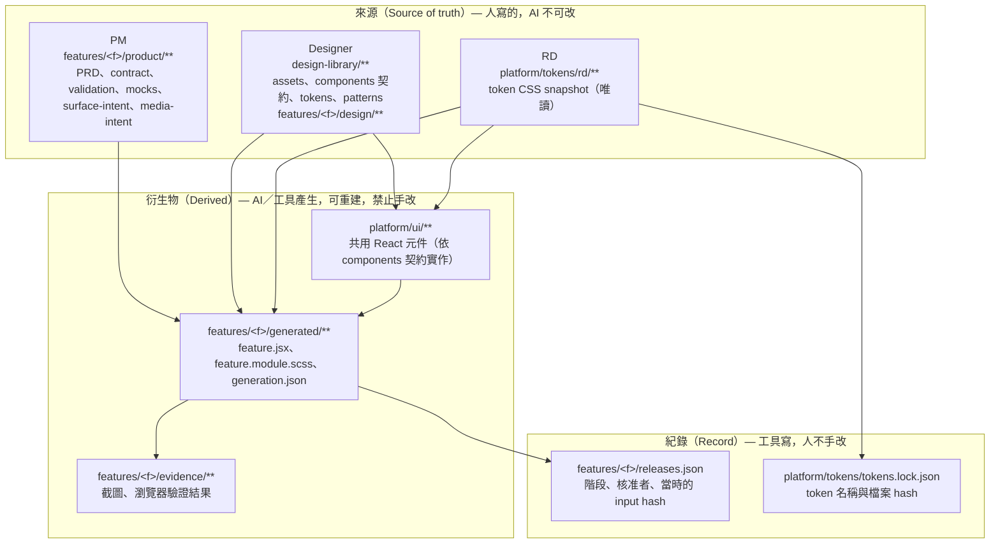
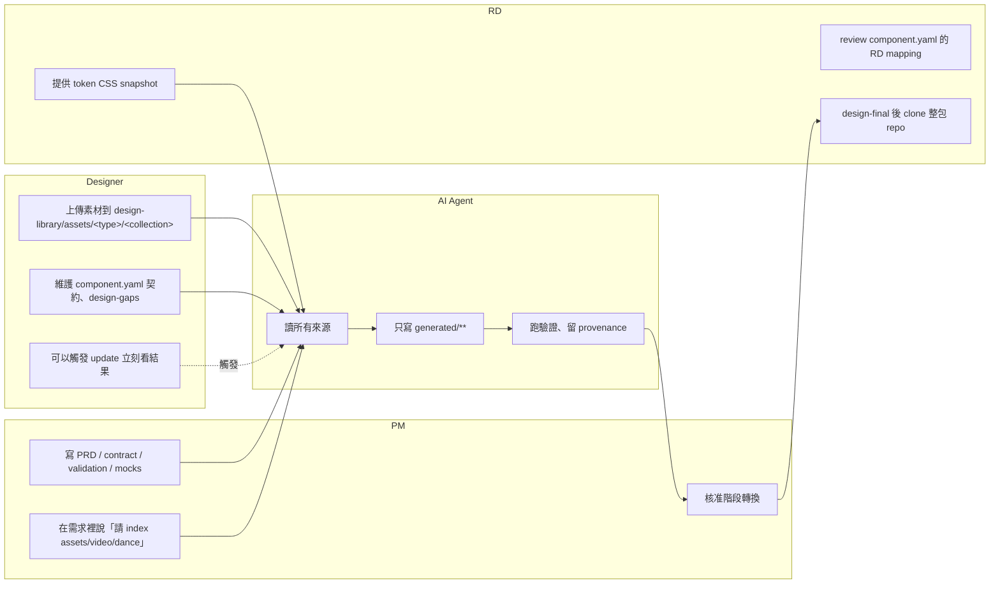
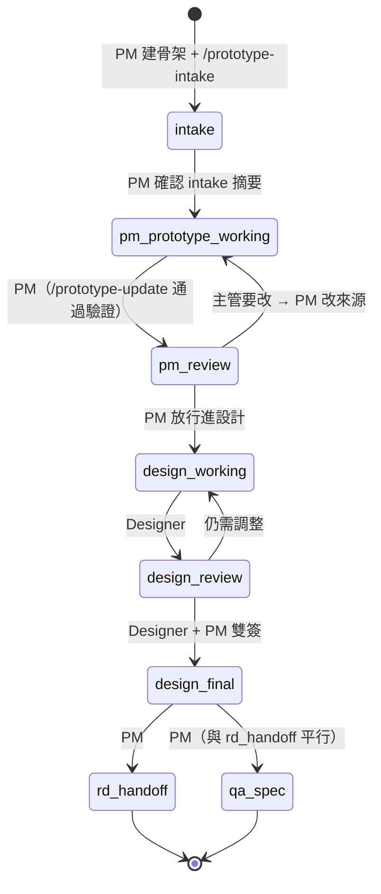
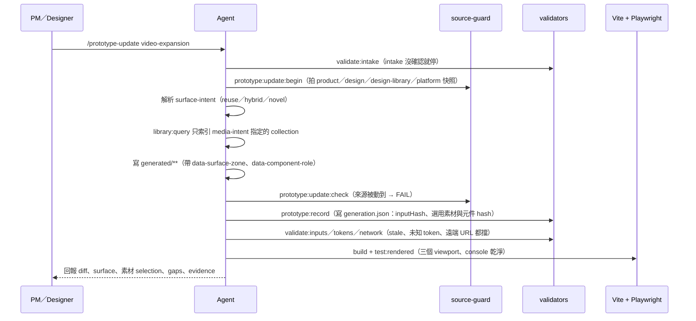
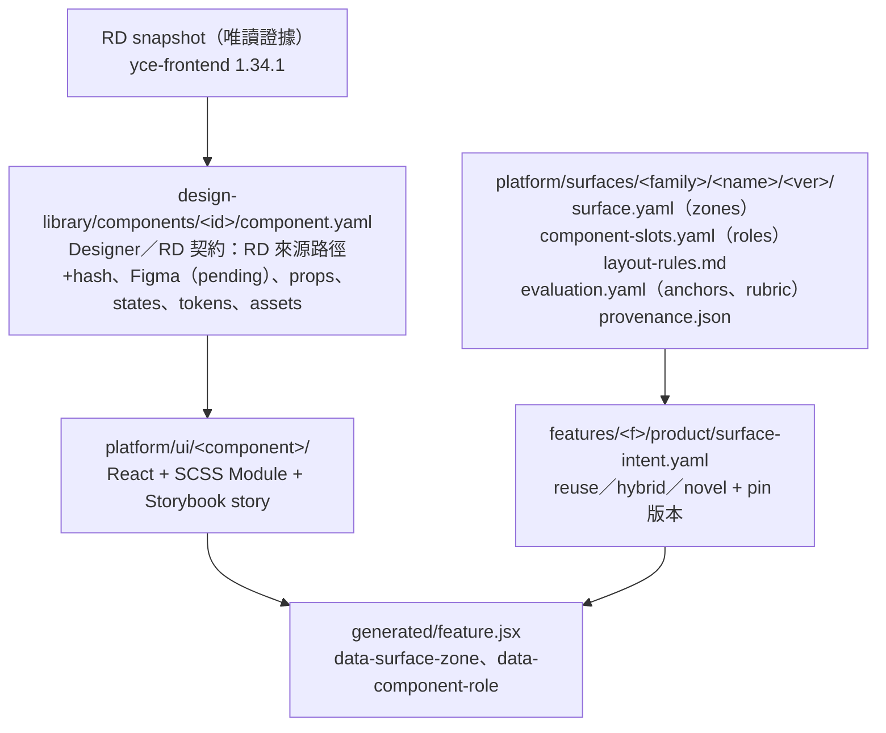

# YCO Collab Space 架構與 PM／Design／RD 共編模式（白話版）

> 讀者：第一次接觸這個 repo 的 PM、Designer、RD、主管。
> 依據：`main` 分支 `be09a65`（2026-09-02）的文件、`collab-space.map.yaml`、`platform/surfaces`、`design-library`、`platform/ui`、`tools/**` 與 `features/video-expansion` 實例。
> 姊妹文件：[優化評估](./2026-09-02-collab-space-optimization.md)。

---

## 1. 一句話

**這個 repo 是「prototype 工廠」：PM 寫需求、Designer 放素材與設計契約、AI 依這些來源生成 React prototype，RD 拿整包 repo 當開發參考。三方各自只改自己的資料夾，AI 負責把它們組起來，工具負責檢查誰動了不該動的東西。**

它**不是** RD production app 的縮小版，永遠只用假資料、不接後端。

---

## 2. 三層資料模型：來源、衍生物、紀錄

整個 repo 裡的檔案只有三種性質。搞清楚這一點，就知道「我可以改什麼」。



| 性質 | 例子 | 誰改 | 改壞了怎麼辦 |
|---|---|---|---|
| 來源 | `product/prd.md`、`design-library/assets/video/dance/*.mp4` | 該角色本人 | 只有本人能修，其他人不動 |
| 衍生物 | `generated/feature.jsx` | AI（跑 `/prototype-update`） | 回到來源修好，重跑一次 |
| 紀錄 | `releases.json` | 工具（`stage:transition`） | 重新走一次核准 |

**核心規則：發現 prototype 不對，不要改 `generated/`，回去改來源，再重生成。** 這樣需求與設計決策不會消失在程式碼裡。

---

## 3. 資料夾地圖（誰的地盤）

```text
yco-collab-space/
├── collab-space.map.yaml      ← 控制平面：角色、階段、路徑權限（機器可讀，工具都讀它）
├── prototype.config.json      ← port、route、viewport
├── features/<feature>/        ← 一個功能一個資料夾，角色用子資料夾切開
│   ├── product/               PM 地盤
│   ├── design/                Designer 地盤（design.ref.json、design-gaps.yaml）
│   ├── generated/             AI 地盤（禁止手改）
│   ├── evidence/              工具地盤（gitignore）
│   └── releases.json          工具地盤（階段紀錄）
├── design-library/            Designer 的全域共用來源
│   ├── assets/<type>/<collection>/   只要丟檔案，不用寫 manifest
│   ├── components/<id>/component.yaml Designer／RD 共同的元件契約
│   ├── tokens/                預留 Figma token export
│   └── patterns/              預留可重用 pattern
├── platform/                  可執行的平台層
│   ├── tokens/rd/<ver>/       RD 提供的 token CSS，唯讀
│   ├── ui/<component>/        依 component.yaml 實作的 React 元件 + Storybook
│   ├── surfaces/<family>/<name>/<ver>/  Surface Pack：頁型骨架
│   └── runtime/               PrototypeFrame（review 外框）
├── app/                       Vite 殼：自動掃 features/*/generated/feature.jsx 做路由
├── tools/                     驗證、生成紀錄、階段轉換、library 索引、evaluation
├── agent-adapters/            Claude／Codex 的 workflow 說明（同一套核心）
└── docs/                      架構決策、design-system 指南、自動產生的 reference
```

`app/src/feature-registry.js` 用 `import.meta.glob` 掃 `features/*/generated/feature.jsx`，所以**新增 feature 不需要註冊**，資料夾放對就會出現在首頁清單。

---

## 4. 三個角色怎麼「共編而不打架」

答案是：**權限綁在路徑，不綁在人。** 誰都可以按「update」，但 update 只能寫 `generated/**`；誰都可以看全部，但只能改自己的來源。



### 4.1 `collab-space.map.yaml` 裡的四個 workflow

每個 workflow 明講「可讀、可寫、受保護」的路徑。工具（`source-guard`）在 update 前對受保護路徑拍快照，結束後比對，**有變動就整個失敗**。

| Workflow | 誰執行 | 可寫 | 受保護（動到就 error） |
|---|---|---|---|
| `prototype-intake` | PM＋Agent | `product/**`、`design/design-gaps.yaml`、`releases.json` | `platform`、`design-library` |
| `prototype-update` | Agent | `generated/**`、`evidence/**`、`.prototype-state`、`.collab-cache` | `product`、`design`、`design-library`、`platform`、map 本身 |
| `design-library-upload` | Designer | `design-library/**` | `features`、`platform`（目前只 warning） |
| `component-foundation-pilot` | PM＋Designer＋RD＋Agent | `design-library/components`、`platform/ui`、`.storybook`、docs | `product`、`generated`、`platform/tokens/rd` |

白話：**PM 改需求時碰不到平台；AI 生成時碰不到需求；Designer 上傳素材時碰不到功能；三方一起改共用元件時碰不到 RD token 與 PM 需求。**

### 4.2 Designer 不用寫 manifest

流程刻意設計成「Designer 只要丟檔案」：

1. Designer 把 web-ready 檔案放到 `design-library/assets/video/dance/`。
2. PM 在 `product/media-intent.yaml` 或對話裡說「請 index `assets/video/dance`」。
3. Agent 只索引該 collection，選出實際用到的檔案。
4. `generation.json` 記下每個檔案的路徑與 sha256。
5. design-final 前 Designer 一次確認 selection。

PM 第一版可以先用 `product/mock-assets/` 的臨時素材，但 design-final gate 會擋。

---

## 5. 一個功能的生命週期（誰在哪一步點頭）



幾個重點：

- **主管不碰 repo。** 主管開 preview URL 看、口頭給 feedback，PM 把 feedback 翻成需求改來源。沒有另一份 feedback log，diff 就是歷史。
- **每次核准綁 hash。** `stage:transition` 把當下的 input hash 與 generation hash 寫進 `releases.json`。之後來源一改，舊核准自動失效。
- **design-final 需要非生成者的獨立 review。** 建的人不能自己蓋章。
- **RD 與 QA 從同一個 design-final 平行拿。** RD 拿整包 repo，QA 拿 YCO-spec（Phase 1）。

---

## 6. 一次 `/prototype-update` 內部發生什麼



`generation.json` 是「這一版 prototype 是用什麼做出來的」的收據：input hash、用了哪些 Design Library 檔案、哪些 `platform/ui` 元件（含契約與實作的 sha256）。`validate:inputs` 發現 input hash 對不上就報 **stale**，代表來源改了但還沒重生成。

---

## 7. `platform/surfaces`、`design-library/components`、`platform/ui` 三層怎麼對起來

repo 作者特別提到看 `platform/surfaces` 結構。它與元件層的關係如下：



| 層 | 回答的問題 | 誰決定 | 目前狀態 |
|---|---|---|---|
| Surface Pack（`platform/surfaces`） | 這種頁面有哪些區域（zone）、哪些元件角色（slot）、responsive 優先序 | Collab Space Owner 實作，Designer＋PM approve | 4 個 `provisional`（product-page、tool-photo-editing、tool-image-generator、tool-video），其餘 `planned` |
| Component 契約（`design-library/components`） | 這個元件從 RD 哪裡來、props／states 是什麼、用哪些 token、Figma 對應 | Designer＋RD | 12 個 `pilot-approved`，Figma 全部 `pending` |
| 實作（`platform/ui`） | 實際可 import 的 React 元件 | AI／Platform Owner 實作，Designer review 視覺 | 12 個，有 Storybook |

### Surface 策略：不是白名單

| 策略 | 意思 | 例子 |
|---|---|---|
| `reuse` | 直接用一個 pack 的骨架 | 新修圖功能用 `workspace/tool-photo-editing` |
| `hybrid` | 主骨架一個，借其他 pack 的角色，記錄偏差 | `video-expansion` 主用 `tool-video`，借 `tool-photo-editing` 的 settings-inspector 與 tool-rail |
| `novel` | 沒合適 pack，自己寫 layout intent | 不會擋 PM review，只是不能拿「像不像既有頁」評分 |

Surface Pack 是加速器，不是准入條件。Pack 版本是日期（`2026-08`），feature 必須 pin 版本，production 樣式更新時開新版，舊 feature 不會被無預警改掉。

---

## 8. 「更新不互相影響」靠哪些機制

| 機制 | 擋什麼 | 在哪 |
|---|---|---|
| Source guard 快照比對 | AI 生成時偷改需求或設計 | `tools/prototype-cli/source-guard.mjs` |
| Input hash → stale 檢查 | 來源改了但 prototype 沒重生成 | `validate:inputs` |
| `generation.json` 鎖檔案／元件 hash | 素材或共用元件被換了卻沒人知道 | `prototype:record`、`validate:components` |
| `tokens.lock.json` + `validate:tokens` | feature 自創顏色或未知 token 名 | `platform/tokens` |
| `validate:network` | prototype 偷連後端或遠端 URL | `tools/prototype-cli` |
| `validate:public-build` | 本機索引、未選素材、Storybook 進到公開 build | `tools/design-library` |
| `releases.json` 綁 hash 的核准 | 舊核准套用到新內容 | `stage:transition` |
| Surface Pack 版本 pin | 更新頁型骨架影響舊 feature | `platform/surfaces/catalog.yaml` |
| 獨立 review agent | 生成者自己蓋 design-final | workflow 規則 |
| Feature-first 目錄 | 兩個 feature 互相踩檔案 | `features/<slug>/` |

一句話總結：**每一次「誰在什麼輸入上點了頭」都有 hash 可查；輸入一變，下游自動失效，必須重跑。**

---

## 9. Product-page track 怎麼掛上去（`feat/product-page-track`）

同一套控制平面可以長出第二條產線。該分支在 `collab-space.map.yaml` 用 `track: product-page` 欄位**加**了五個階段與六個轉換，沒有改動既有 prototype 階段：

```text
page-brief → page-generated → page-pm-review → page-strapi-draft → page-published
                                     ↑              │
                                     └── revision ──┘
```

新增的角色地盤：`product-library/`（PM 素材庫）、`design-library/patterns/product-page/`（Designer 版面 pattern）、`strapi/`（RD 的 CMS registry）、`tools/product-page/`（驗證與 dry-run push）。設計原則與主線一致：加不減、各角色各自資料夾、發布前有 evidence。

> 注意：該分支的 base 是 `16d9dda`，落後 `main` 四個 commit（含 video-expansion 合併與整批 `platform/ui`）。合併前需 rebase，見優化文件第 12 項。

---

## 10. 現況快照（2026-09-02）

| 項目 | 狀態 |
|---|---|
| Features | `collab-space-readiness`（fixture，`pm-prototype-working`）、`video-expansion`（已給主管看，但 `releases.json` 仍記 `intake`） |
| Surface Packs | 4 provisional、16 planned |
| Component 契約／實作 | 12 個 pilot-approved，Figma mapping 全 pending |
| Token 基準 | RD 1.34.1，249 baseline + 3 custom（待 Designer／RD 決定） |
| 自動化 gate | validate、build、rendered、mutation、workflow eval 都有；**只在本機跑，沒有 CI** |
| 人類 Git 權限 | 文件化，未強制（無 CODEOWNERS、無 branch protection） |
| Preview | Vercel 設定檔存在，尚未 link；public、mock-only |
| Designer 流程 | 仍是提案，待 Designer 看過同意才強制 |

---

## 11. 三個角色的「我今天要做什麼」速查

**PM**
```bash
npm run prototype:create -- my-feature "My Feature"
# 對 agent 說：/prototype-intake my-feature → 確認摘要
# 對 agent 說：/prototype-update my-feature
npm run dev            # 本機看
# 對 agent 說：「把 my-feature 送到 pm review」
```

**Designer**
```bash
# 把檔案放進 design-library/assets/<type>/<collection>/
npm run library:browser   # 本機看所有 collection
npm run storybook         # 看共用元件
# 改 design-library/components/<id>/component.yaml → npm run validate:components
# 對 agent 說：/prototype-update my-feature 看結果；缺 token 記到 design/design-gaps.yaml
```

**RD**
```bash
git clone <private repo>
# 看 features/<f>/generated/README.md：哪些是 RD port、哪些是 feature-owned
# 看 design-library/components/*/component.yaml 的 rd.sourcePaths + sha256
# 看 platform/tokens/tokens.lock.json 確認 token 版本
# 不把 RD repo 合回來；prototype 永遠不接後端
```
